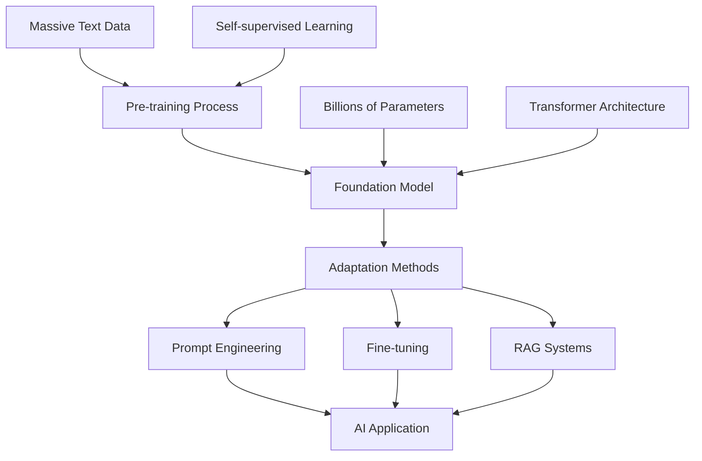
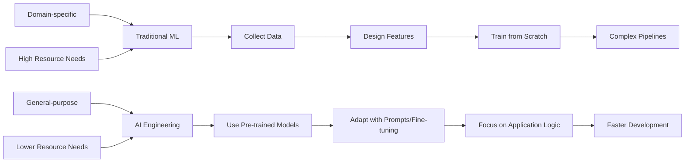
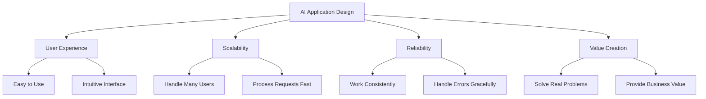

# Chapter 1: Introduction to AI Engineering

## Overview

AI engineering is building applications using large, pre-trained models called foundation models. Instead of training models from scratch, we use these powerful models and adapt them for specific tasks.

## What are Foundation Models?

Foundation models are huge AI models trained on massive amounts of data. Examples include GPT, BERT, and T5. They can:
- Understand and generate text
- Work across many different tasks
- Be adapted for specific needs with minimal training

## How Foundation Models Work



## Types of Foundation Models

### Masked Language Models (like BERT)
- Predict missing words in sentences
- Great for understanding text
- Example: "The [MASK] is bright" → "The sun is bright"

### Autoregressive Models (like GPT)
- Generate text word by word
- Great for creating content
- Example: "Once upon a time" → "Once upon a time there was a magical forest"

## AI Engineering vs Traditional ML



## Product-Oriented Approach

Building AI applications isn't just about the model. You need to consider:



## Simple Example: Using a Foundation Model

Here's how easy it is to use a foundation model:

```python
# Simple example using a pre-trained model
from transformers import pipeline

# Load a pre-trained model for text classification
classifier = pipeline("sentiment-analysis")

# Use it immediately
text = "I love this new AI technology!"
result = classifier(text)

print(f"Text: {text}")
print(f"Sentiment: {result[0]['label']}")
print(f"Confidence: {result[0]['score']:.2f}")
```

**What this code does:**
1. **Loads a pre-trained model** - No training needed!
2. **Classifies text sentiment** - Positive, negative, or neutral
3. **Returns results** - Label and confidence score

## Key Terms

- **Foundation Models**: Large pre-trained AI models
- **Masked Language Models**: Models that predict missing words
- **Autoregressive Models**: Models that generate text sequentially
- **AI Engineering**: Building applications with foundation models
- **Prompt Engineering**: Crafting inputs to guide model behavior
- **Fine-tuning**: Adapting models for specific tasks

## Key Takeaways

1. **Foundation models make AI development faster** - no need to train from scratch
2. **Focus on user experience** - not just model accuracy
3. **Understand model strengths** - choose the right tool for the job
4. **Start simple** - use pre-trained models before building custom ones
