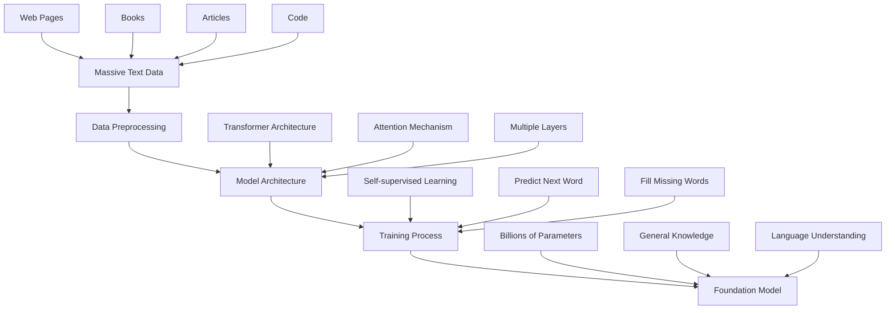
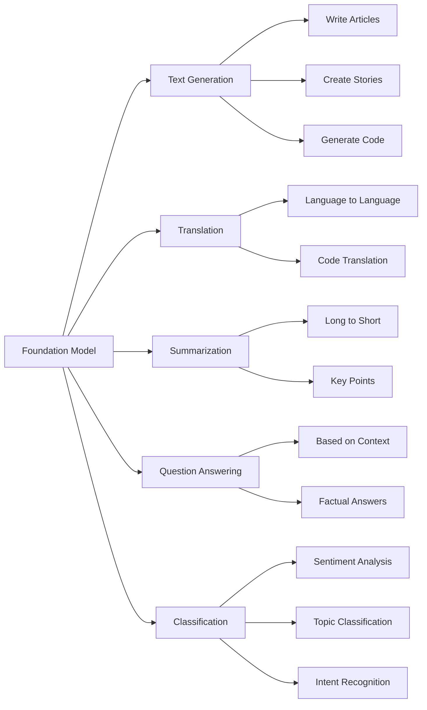
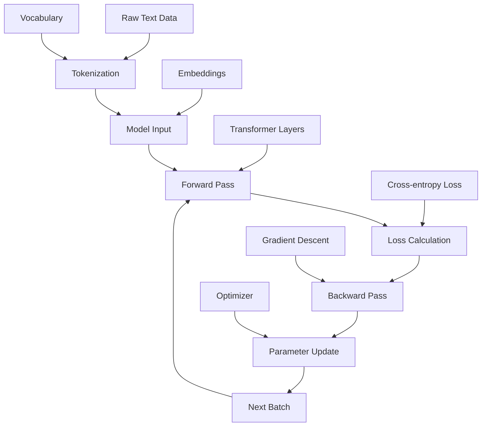

# Chapter 2: Understanding Foundation Models

## Overview

Foundation models are huge AI systems trained on massive amounts of data. They can understand language, generate text, and adapt to many different tasks. Think of them as very smart assistants that can help with almost any language task.

## What are Foundation Models?

Foundation models are like super-powered language models that:
- Are trained on billions of text examples
- Can understand and generate human language
- Can be adapted for specific tasks easily
- Work across many different applications

## How Foundation Models Work



### The Training Process
1. **Collect Data**: Gather massive amounts of text from books, websites, articles
2. **Clean Data**: Remove duplicates and inappropriate content
3. **Train Model**: Use powerful computers to learn patterns in the data
4. **Adapt**: Fine-tune for specific tasks

### Model Architecture
- **Transformers**: The technology that makes these models work
- **Attention**: How models focus on important parts of text
- **Layers**: Multiple processing layers that understand different aspects of language

## What Foundation Models Can Do



### Capabilities
- **Text Generation**: Write articles, stories, code
- **Translation**: Convert between languages
- **Summarization**: Create short versions of long texts
- **Question Answering**: Answer questions based on context
- **Classification**: Categorize text (positive/negative, topic, etc.)

### Limitations
- **Bias**: Can reflect biases in training data
- **Hallucinations**: Sometimes make up false information
- **Cost**: Expensive to run and train
- **Black Box**: Hard to understand how they make decisions

## Practical Example: Using BERT

Here's how to use a foundation model for text classification:

```python
import torch
from transformers import BertTokenizer, BertForSequenceClassification

# Load the model
tokenizer = BertTokenizer.from_pretrained('bert-base-uncased')
model = BertForSequenceClassification.from_pretrained('bert-base-uncased', num_labels=2)
model.eval()

# Example text
text = "I love this movie! It's amazing."

# Process the text
inputs = tokenizer(text, return_tensors="pt", truncation=True, padding=True)

# Get prediction
with torch.no_grad():
    outputs = model(**inputs)
    probabilities = torch.softmax(outputs.logits, dim=1)
    predicted_class = torch.argmax(outputs.logits, dim=1)

print(f"Text: {text}")
print(f"Predicted class: {predicted_class.item()}")
print(f"Confidence: {probabilities.max().item():.3f}")
```

**What this code does:**
1. **Loads BERT model** - A popular foundation model
2. **Tokenizes text** - Converts words to numbers the model understands
3. **Makes prediction** - Classifies the text sentiment
4. **Returns results** - Class and confidence score

## Model Training Process



## Key Terms

- **Foundation Model**: Large AI model trained on massive data
- **Transformer**: Architecture that powers modern AI models
- **Fine-tuning**: Adapting a model for specific tasks
- **Hallucination**: When models generate false information
- **Bias**: Unintended preferences learned from data
- **Tokenization**: Converting text to numerical tokens
- **Embeddings**: Numerical representations of words

## Key Takeaways

1. **Foundation models are powerful** because they're trained on massive amounts of data
2. **They can do many tasks** with minimal additional training
3. **They have limitations** like bias and hallucinations that need to be managed
4. **They're easy to use** with modern libraries like Hugging Face
5. **Understanding their architecture** helps you use them effectively 