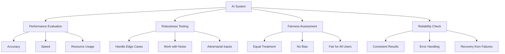
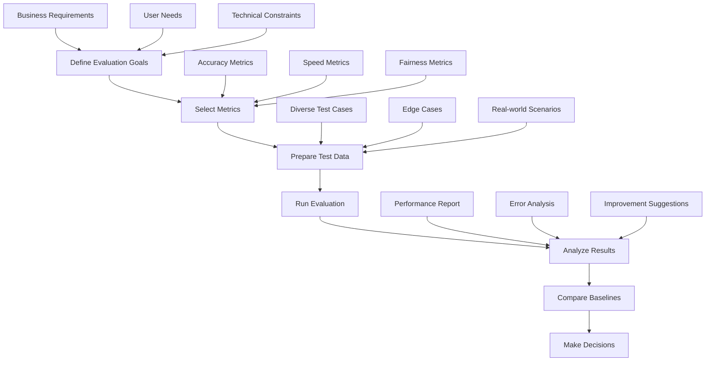
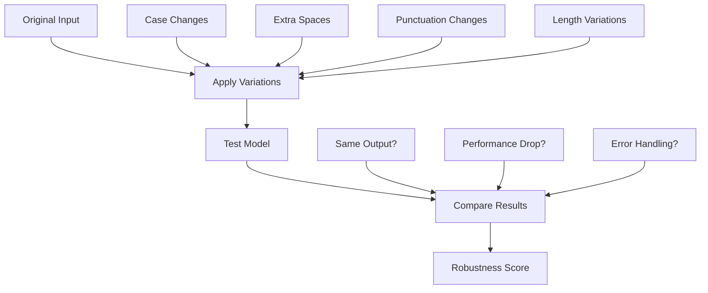

# Chapter 3: Evaluation Methodology

## Overview

Evaluating AI systems is crucial to ensure they work well in real-world scenarios. This chapter covers how to measure model performance, test for robustness, and ensure fairness.

## Why Evaluate AI Systems?



- **Performance**: Does the model work accurately?
- **Robustness**: Does it handle edge cases well?
- **Fairness**: Does it treat all users equally?
- **Reliability**: Does it work consistently?

## Key Evaluation Metrics

### Basic Metrics
- **Accuracy**: Percentage of correct predictions
- **Precision**: How many positive predictions were actually correct
- **Recall**: How many actual positives were found
- **F1 Score**: Balance between precision and recall

### Performance Metrics
- **Latency**: How fast the model responds
- **Throughput**: How many requests it can handle
- **Memory Usage**: How much RAM it needs

## Evaluation Process



## Evaluation Challenges

- **Scale**: Large models need lots of resources to test
- **Bias**: Hard to detect unfair treatment
- **Hallucinations**: Models sometimes make up false information
- **Interpretability**: Hard to understand how models make decisions

## Practical Evaluation Example

Here's how to evaluate a foundation model:

```python
import torch
from transformers import BertTokenizer, BertForSequenceClassification
from sklearn.metrics import accuracy_score, classification_report
import time

# Load model
tokenizer = BertTokenizer.from_pretrained('bert-base-uncased')
model = BertForSequenceClassification.from_pretrained('bert-base-uncased', num_labels=2)
model.eval()

# Test data
test_texts = [
    "This movie is fantastic!",
    "I love this product.",
    "This is terrible.",
    "Great service!",
    "Poor quality."
]

test_labels = [1, 1, 0, 1, 0]  # 1: positive, 0: negative

# Evaluate function
def evaluate_model(texts, labels, model, tokenizer):
    predictions = []
    times = []
    
    for text, label in zip(texts, labels):
        inputs = tokenizer(text, return_tensors="pt", truncation=True, padding=True)
        
        start_time = time.time()
        with torch.no_grad():
            outputs = model(**inputs)
            pred = torch.argmax(outputs.logits, dim=1)
        end_time = time.time()
        
        predictions.append(pred.item())
        times.append(end_time - start_time)
    
    accuracy = accuracy_score(labels, predictions)
    avg_time = sum(times) / len(times)
    
    return accuracy, avg_time, predictions

# Run evaluation
predictions, inference_times = evaluate_model(test_texts, test_labels, model, tokenizer)

# Calculate metrics
accuracy = accuracy_score(test_labels, predictions)
avg_time = sum(inference_times) / len(inference_times)

print(f"Accuracy: {accuracy:.3f}")
print(f"Average response time: {avg_time:.4f} seconds")
print(f"Throughput: {1/avg_time:.2f} requests/second")

# Detailed report
print("\nDetailed Report:")
print(classification_report(test_labels, predictions, target_names=['Negative', 'Positive']))
```

**What this code does:**
1. **Loads a model** - BERT for text classification
2. **Tests with sample data** - Positive and negative examples
3. **Measures accuracy** - How many predictions are correct
4. **Measures speed** - How fast the model responds
5. **Generates report** - Detailed performance analysis

## Robustness Testing



## Best Practices

1. **Test on diverse data** - Include different types of inputs
2. **Compare with baselines** - See how your model performs vs simpler alternatives
3. **Automate testing** - Use scripts for consistent evaluation
4. **Monitor continuously** - Keep tracking performance after deployment

## Key Terms

- **Accuracy**: Percentage of correct predictions
- **Precision**: True positives / (True positives + False positives)
- **Recall**: True positives / (True positives + False negatives)
- **F1 Score**: Harmonic mean of precision and recall
- **Latency**: Time to get a response
- **Throughput**: Requests handled per second
- **Robustness**: How well model handles variations
- **Fairness**: Equal treatment across different groups

## Key Takeaways

1. **Evaluation is essential** - Always test your AI systems thoroughly
2. **Use multiple metrics** - Don't rely on just accuracy
3. **Test for robustness** - Make sure it handles edge cases
4. **Monitor continuously** - Keep evaluating after deployment
5. **Automate evaluation** - Make testing consistent and repeatable 