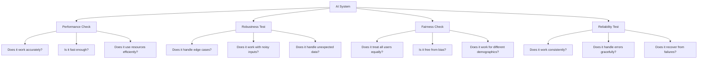
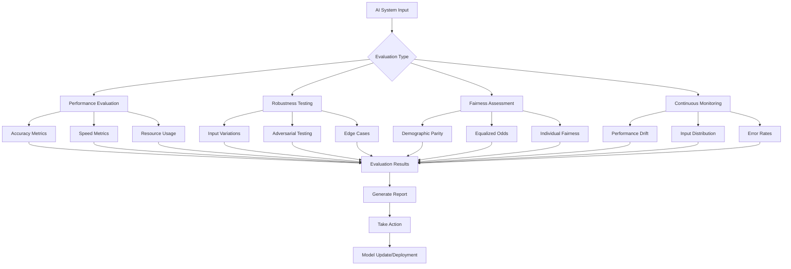
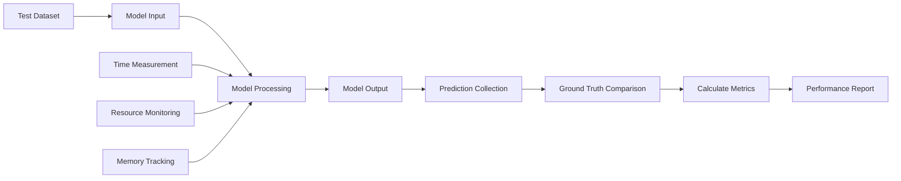
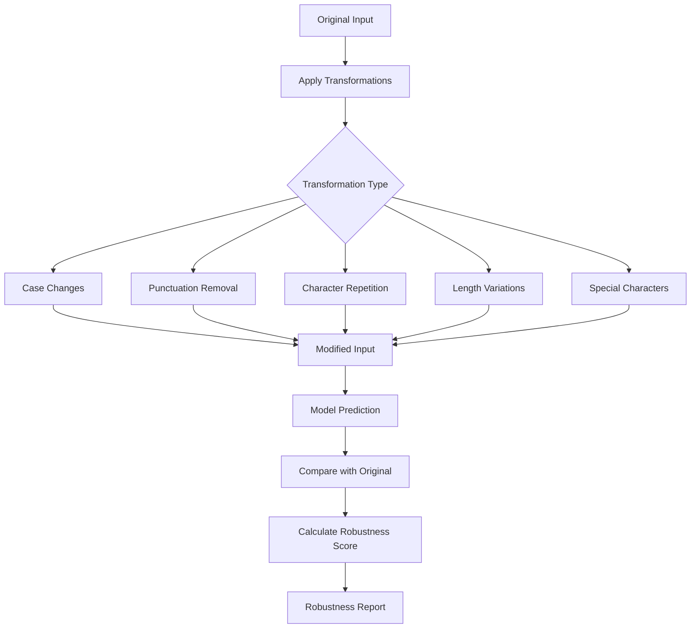
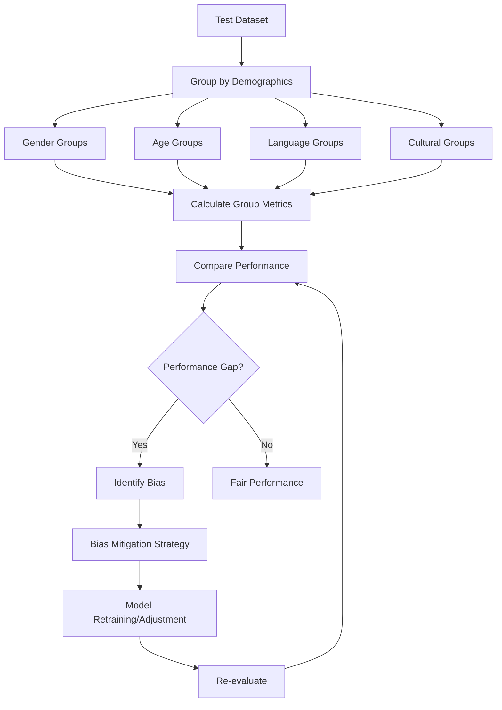

# Chapter 4: Evaluating AI Systems

## Overview

This chapter shows how to evaluate AI systems in practice. We'll cover performance testing, robustness checks, and fairness assessment to ensure your AI works well for everyone.

## Why Evaluate AI Systems?



- **Performance**: Does it work accurately and quickly?
- **Robustness**: Does it handle unexpected inputs well?
- **Fairness**: Does it treat all users equally?
- **Reliability**: Does it work consistently over time?

## Evaluation Framework



## 1. Performance Evaluation

Measure how well your model works:

### Accuracy Metrics
- **Precision**: How many positive predictions were actually correct
- **Recall**: How many actual positives were found
- **F1-score**: Balance between precision and recall
- **Accuracy**: Percentage of correct predictions

### Speed Metrics
- **Inference Time**: How fast the model responds
- **Throughput**: Requests handled per second
- **Latency**: Total time including processing

### Performance Evaluation Flow



## 2. Robustness Testing

Test how your model handles different situations:

### Input Variations
- **Case Changes**: Uppercase, lowercase, mixed case
- **Punctuation**: Different punctuation styles
- **Length**: Very short or very long inputs
- **Format**: Different text structures

### Adversarial Testing
- **Small Changes**: Minor modifications that shouldn't affect output
- **Out-of-Distribution**: Inputs very different from training data
- **Edge Cases**: Unusual or boundary conditions

### Robustness Testing Process



## 3. Fairness Assessment

Ensure your model treats everyone fairly:

### Demographic Parity
- **Gender**: Equal performance across genders
- **Age**: Consistent results across age groups
- **Language**: Works equally well for different languages
- **Culture**: No cultural biases

### Equalized Odds
- **False Positive Rate**: Same rate of incorrect positives across groups
- **False Negative Rate**: Same rate of incorrect negatives across groups
- **Balanced Performance**: No group is disadvantaged

### Fairness Assessment Flow



## Practical Implementation

Here's a simple evaluation system:

```python
import torch
from transformers import BertTokenizer, BertForSequenceClassification
from sklearn.metrics import accuracy_score, classification_report
import time

# Load model
tokenizer = BertTokenizer.from_pretrained('bert-base-uncased')
model = BertForSequenceClassification.from_pretrained('bert-base-uncased', num_labels=2)
model.eval()

# Test data
test_texts = [
    "This product is amazing!",
    "I love this service.",
    "This is terrible quality.",
    "Great experience overall.",
    "Poor customer service."
]

test_labels = [1, 1, 0, 1, 0]  # 1: positive, 0: negative

def evaluate_performance(texts, labels, model, tokenizer):
    """Evaluate model performance"""
    predictions = []
    times = []
    
    for text, label in zip(texts, labels):
        inputs = tokenizer(text, return_tensors="pt", truncation=True, padding=True)
        
        start_time = time.time()
        with torch.no_grad():
            outputs = model(**inputs)
            pred = torch.argmax(outputs.logits, dim=1)
        end_time = time.time()
        
        predictions.append(pred.item())
        times.append(end_time - start_time)
    
    accuracy = accuracy_score(labels, predictions)
    avg_time = sum(times) / len(times)
    
    return accuracy, avg_time, predictions

def test_robustness(texts, labels, model, tokenizer):
    """Test model robustness with input variations"""
    print("\n--- Robustness Testing ---")
    
    # Test case sensitivity
    upper_texts = [text.upper() for text in texts[:3]]
    acc_upper, _, _ = evaluate_performance(upper_texts, labels[:3], model, tokenizer)
    print(f"Uppercase accuracy: {acc_upper:.3f}")
    
    # Test with extra spaces
    spaced_texts = [text.replace(" ", "   ") for text in texts[:3]]
    acc_spaced, _, _ = evaluate_performance(spaced_texts, labels[:3], model, tokenizer)
    print(f"Extra spaces accuracy: {acc_spaced:.3f}")

# Run evaluations
print("--- Performance Evaluation ---")
accuracy, avg_time, predictions = evaluate_performance(test_texts, test_labels, model, tokenizer)

print(f"Accuracy: {accuracy:.3f}")
print(f"Average response time: {avg_time:.4f} seconds")
print(f"Throughput: {1/avg_time:.2f} requests/second")

print("\n--- Detailed Report ---")
print(classification_report(test_labels, predictions, target_names=['Negative', 'Positive']))

# Test robustness
test_robustness(test_texts, test_labels, model, tokenizer)
```

**What this code does:**
1. **Loads a model** - BERT for sentiment analysis
2. **Tests performance** - Measures accuracy and speed
3. **Tests robustness** - Checks how it handles input variations
4. **Generates reports** - Provides detailed analysis
5. **Identifies issues** - Finds potential problems

## Best Practices

1. **Test on diverse data** - Include different types of inputs
2. **Compare with baselines** - See how your model performs vs simpler alternatives
3. **Automate testing** - Use scripts for consistent evaluation
4. **Monitor continuously** - Keep tracking performance after deployment

## Key Terms

- **Performance Evaluation**: Measuring accuracy, speed, and efficiency
- **Robustness Testing**: Testing how well models handle variations
- **Fairness Assessment**: Ensuring equal treatment across groups
- **Demographic Parity**: Equal performance across different demographics
- **Equalized Odds**: Similar error rates across groups
- **Adversarial Testing**: Testing with intentionally difficult inputs

## Key Takeaways

1. **Evaluate systematically** - Use structured approaches for testing
2. **Test for robustness** - Make sure it handles edge cases
3. **Check for fairness** - Ensure equal treatment for all users
4. **Monitor continuously** - Keep evaluating after deployment
5. **Automate evaluation** - Make testing consistent and repeatable 