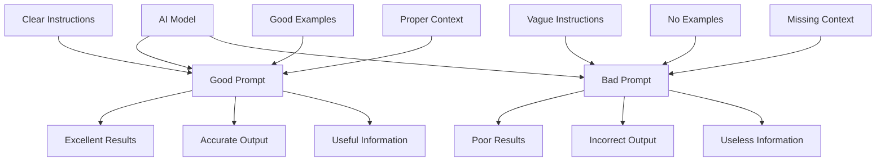
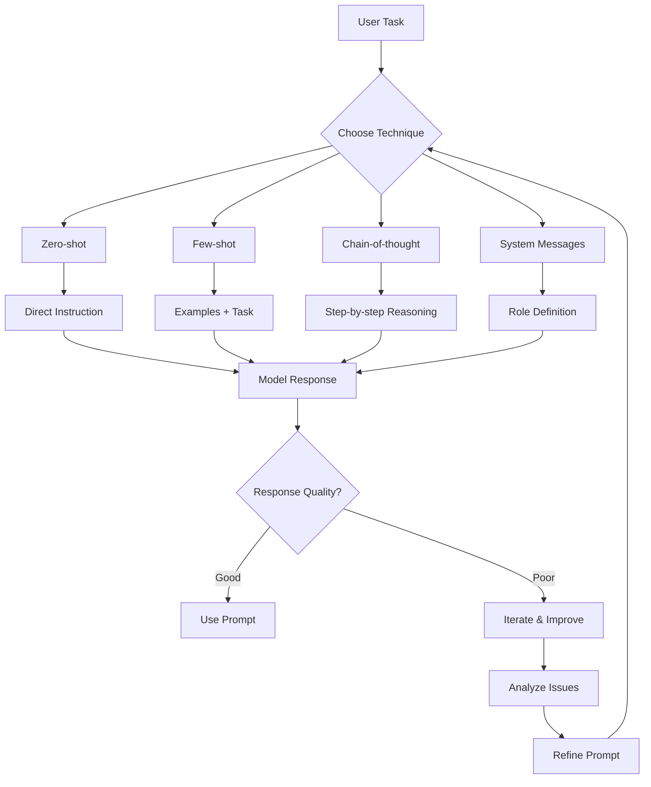
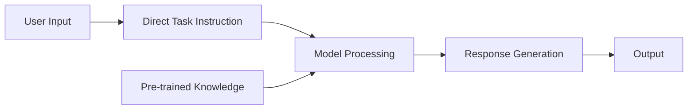
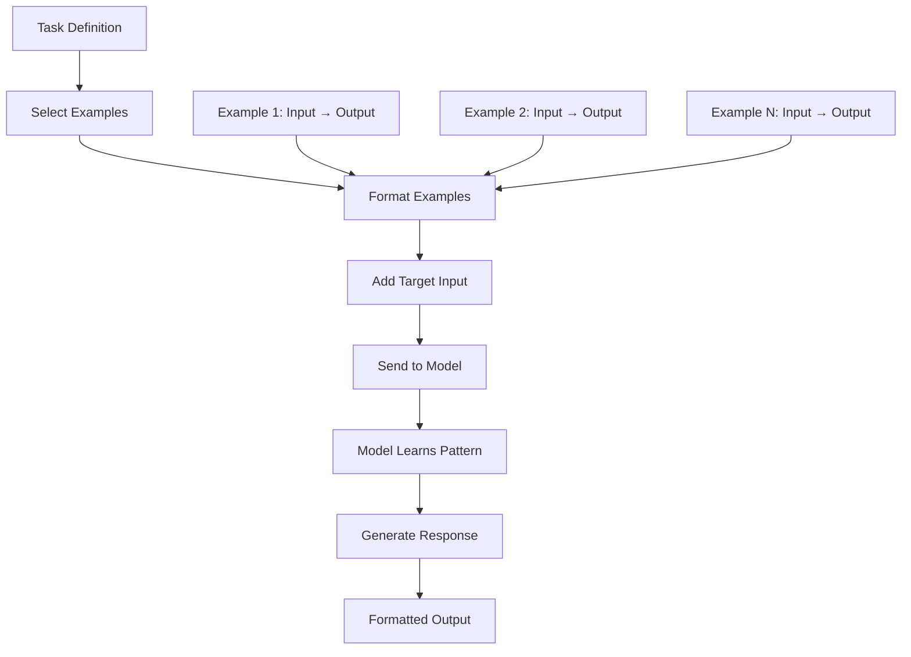
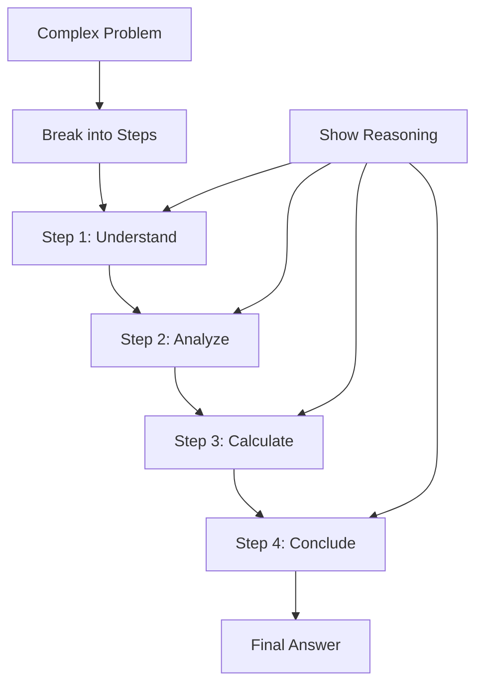
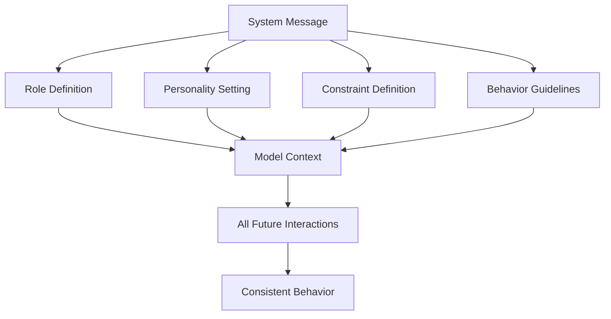
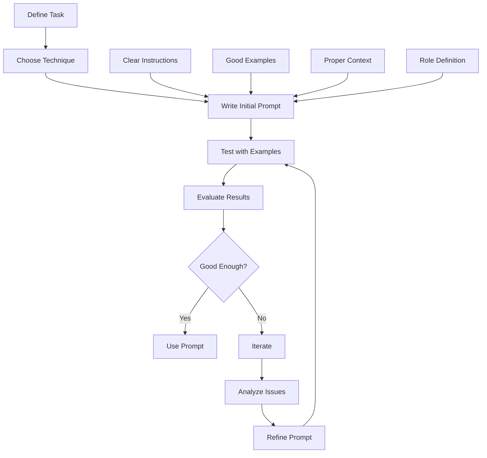

# Chapter 5: Prompt Engineering

## Overview

Prompt engineering is the art of crafting effective instructions for AI models. It's like learning to speak the right language to get the best results from foundation models. This chapter covers techniques to make AI models understand exactly what you want them to do.

## What is Prompt Engineering?

Prompt engineering is designing inputs that guide AI models to produce the desired outputs. Instead of writing code, you write natural language instructions that help the model understand your task.

### Why It Matters



AI models are powerful but can be unpredictable. The same model might give great results with one prompt and poor results with another. Good prompt engineering bridges this gap.

## Prompt Engineering Techniques



## 1. Zero-Shot Prompting

Give the model a task without examples, relying on its pre-trained knowledge.

**When to Use**: Simple, common tasks
**Example**: "Summarize this text in one sentence: [text]"



## 2. Few-Shot Prompting

Provide examples to help the model understand the desired format.

**When to Use**: Tasks requiring specific formats or consistent outputs
**Example**:
```
Classify sentiment:

Input: "I love this movie!"
Output: positive

Input: "This is terrible."
Output: negative

Now classify:
Input: "The food was delicious!"
Output:
```



## 3. Chain-of-Thought Prompting

Encourage step-by-step reasoning for complex problems.

**When to Use**: Complex reasoning tasks, math problems
**Example**:
```
Let's solve this step by step:

Problem: If a train leaves at 2 PM at 60 mph, and another leaves at 3 PM at 80 mph toward it, when will they meet?

Let me think:
1) First, understand the scenario...
2) Calculate distances and times...
3) Determine meeting point...
```



## 4. System Messages

Define the model's role and behavior at a high level.

**When to Use**: Setting up consistent behavior across interactions
**Example**: "You are a helpful coding assistant. Always provide clear, well-commented code."



## Practical Examples

Here's how to implement these techniques:

```python
import openai
import os

# Setup
openai.api_key = os.getenv("OPENAI_API_KEY")

# 1. Zero-shot prompting
def zero_shot_summarize(text):
    prompt = f"Summarize the following text in one sentence: {text}"
    response = openai.ChatCompletion.create(
        model="gpt-3.5-turbo",
        messages=[{"role": "user", "content": prompt}]
    )
    return response.choices[0].message.content

# 2. Few-shot prompting
def few_shot_classify(text):
    prompt = f"""
    Classify the sentiment of the following texts:

    Input: "I love this movie!"
    Output: positive

    Input: "This is terrible."
    Output: negative

    Now classify:
    Input: "{text}"
    Output:"""
    
    response = openai.ChatCompletion.create(
        model="gpt-3.5-turbo",
        messages=[{"role": "user", "content": prompt}]
    )
    return response.choices[0].message.content

# 3. Chain-of-thought
def chain_of_thought_math(problem):
    prompt = f"""
    Let's solve this step by step:

    Problem: {problem}

    Let me think through this:
    1) First, I need to understand what's being asked...
    2) Then I'll identify the key information...
    3) Next, I'll work through the solution...
    4) Finally, I'll provide the answer.
    """
    
    response = openai.ChatCompletion.create(
        model="gpt-3.5-turbo",
        messages=[{"role": "user", "content": prompt}]
    )
    return response.choices[0].message.content

# 4. System message
def coding_assistant(code_request):
    system_message = "You are a helpful coding assistant. Always provide clear, well-commented code examples."
    
    response = openai.ChatCompletion.create(
        model="gpt-3.5-turbo",
        messages=[
            {"role": "system", "content": system_message},
            {"role": "user", "content": code_request}
        ]
    )
    return response.choices[0].message.content

# Test the functions
if __name__ == "__main__":
    # Test zero-shot
    text = "The quick brown fox jumps over the lazy dog. This is a pangram that contains every letter of the alphabet."
    print("Zero-shot summary:", zero_shot_summarize(text))
    
    # Test few-shot
    test_text = "This product exceeded my expectations!"
    print("Few-shot classification:", few_shot_classify(test_text))
    
    # Test chain-of-thought
    math_problem = "If I have 5 apples and give 2 to my friend, how many do I have left?"
    print("Chain-of-thought solution:", chain_of_thought_math(math_problem))
    
    # Test system message
    code_request = "Write a Python function to calculate the factorial of a number"
    print("Coding assistant response:", coding_assistant(code_request))
```

**What this code does:**
1. **Zero-shot**: Direct instruction without examples
2. **Few-shot**: Provides examples to teach the model
3. **Chain-of-thought**: Encourages step-by-step reasoning
4. **System message**: Sets the model's role and behavior

## Prompt Engineering Process



## Best Practices

1. **Be Clear and Specific**: Use precise language to avoid ambiguity
2. **Provide Context**: Give enough information for the model to understand
3. **Use Examples**: Show the model what you want with examples
4. **Iterate and Test**: Try different prompts and see what works best
5. **Consider Constraints**: Set boundaries for what the model should and shouldn't do

## Key Terms

- **Prompt Engineering**: Designing inputs to guide AI model outputs
- **Zero-shot**: Task instruction without examples
- **Few-shot**: Task instruction with examples
- **Chain-of-thought**: Step-by-step reasoning approach
- **System Message**: High-level role and behavior definition
- **Context**: Information that helps the model understand the task

## Key Takeaways

1. **Prompt engineering is crucial** - The right prompt makes all the difference
2. **Choose the right technique** - Different tasks need different approaches
3. **Iterate and improve** - Test and refine your prompts
4. **Be specific and clear** - Ambiguous prompts lead to poor results
5. **Use examples when helpful** - They guide the model to better outputs 