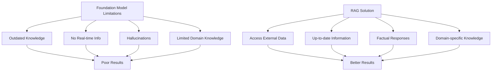
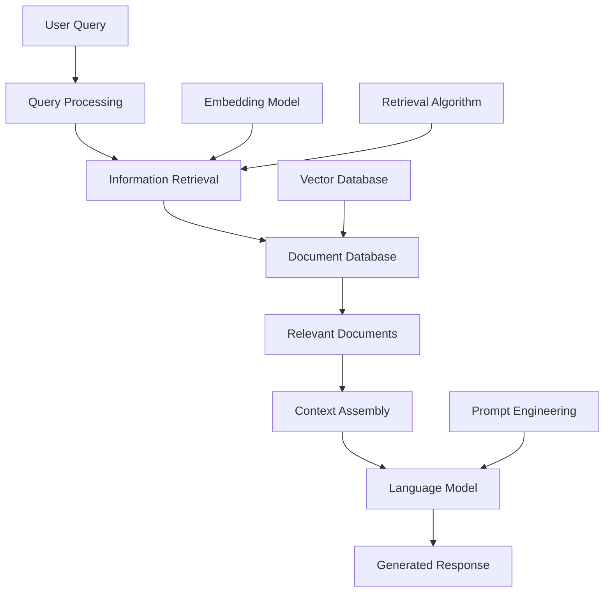
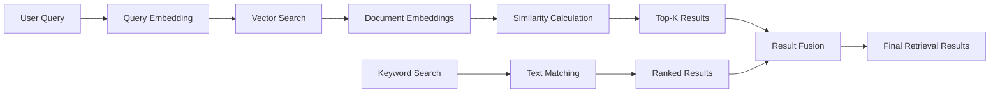
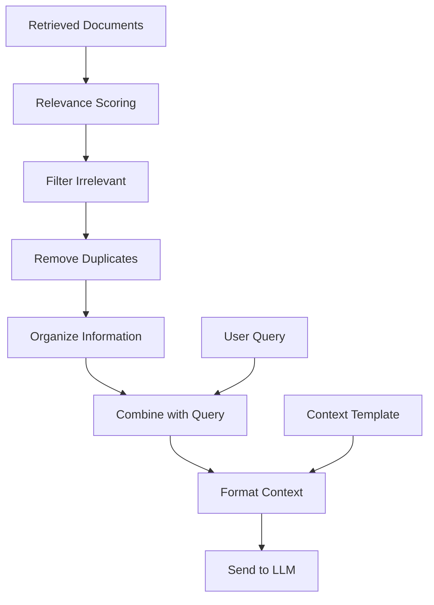
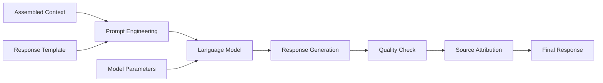
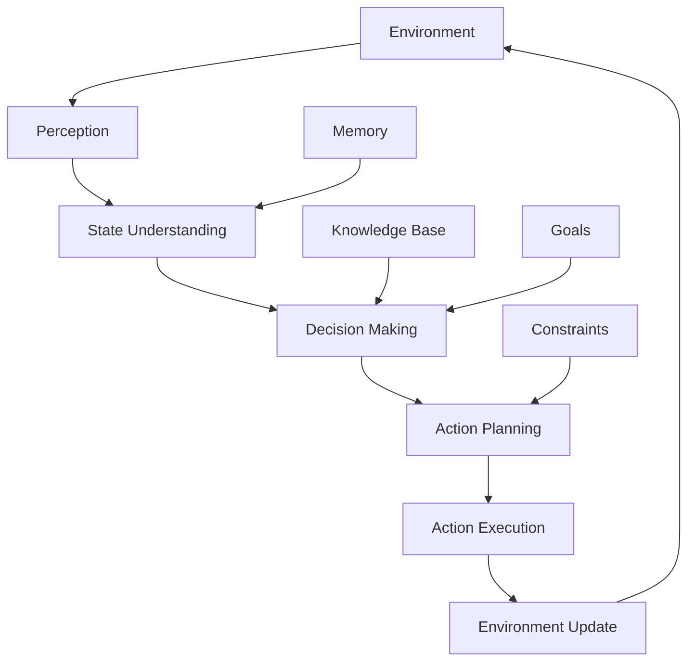
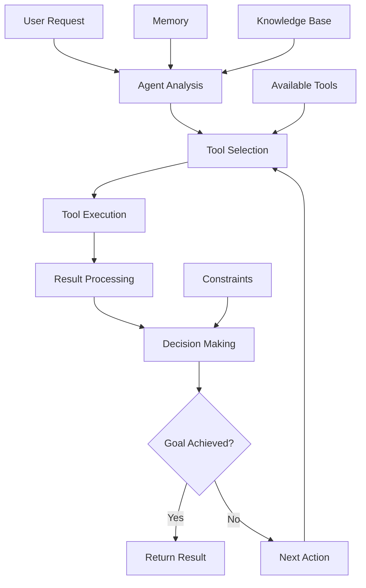

# Chapter 6: RAG and Agents

## Overview

RAG (Retrieval-Augmented Generation) and AI agents are powerful techniques for building smarter AI systems. RAG combines information retrieval with text generation, while agents can make decisions and take actions autonomously.

## What is RAG?

RAG combines two powerful capabilities:
- **Retrieval**: Finding relevant information from external sources
- **Generation**: Creating responses using that information

### Why RAG Matters



Foundation models have limitations:
- **Outdated knowledge**: Models are trained on old data
- **No real-time info**: Can't access current information
- **Hallucinations**: Sometimes make up false information
- **Limited domain knowledge**: May not know about specific topics

RAG solves these by providing access to external, up-to-date information.

## RAG Architecture



## RAG Components

### 1. Information Retrieval

Find relevant documents from a large collection:

**Vector Search**: Convert text to numbers and find similar items
**Keyword Search**: Traditional text-based search
**Hybrid Search**: Combine both approaches



### 2. Context Assembly

Combine retrieved information with the query:

**Strategies**:
- **Concatenation**: Simply combine query and documents
- **Structured Assembly**: Organize information in specific format
- **Relevance Filtering**: Remove irrelevant information
- **Length Optimization**: Fit within model limits



### 3. Response Generation

Generate accurate responses using the assembled context:

**Key Considerations**:
- **Source Attribution**: Cite sources for transparency
- **Confidence Scoring**: Show how certain the model is
- **Fallback Handling**: What to do when retrieval fails
- **Response Quality**: Ensure coherent and accurate responses



## Practical RAG Implementation

Here's a simple RAG system:

```python
from langchain.embeddings import OpenAIEmbeddings
from langchain.vectorstores import Chroma
from langchain.text_splitter import CharacterTextSplitter
from langchain.llms import OpenAI
from langchain.chains import RetrievalQA

# 1. Prepare documents
def prepare_documents():
    """Prepare documents for RAG system"""
    
    documents = [
        "AI engineering focuses on building applications with foundation models.",
        "RAG combines retrieval and generation for better AI responses.",
        "Prompt engineering is crucial for effective model interaction.",
        "Evaluation ensures AI systems meet real-world requirements."
    ]
    
    # Split documents into chunks
    text_splitter = CharacterTextSplitter(
        chunk_size=1000,
        chunk_overlap=200
    )
    
    texts = text_splitter.create_documents(documents)
    return texts

# 2. Create vector store
def create_vector_store(texts):
    """Create and populate vector store"""
    
    embeddings = OpenAIEmbeddings()
    vectorstore = Chroma.from_documents(
        documents=texts,
        embedding=embeddings
    )
    
    return vectorstore

# 3. Create RAG chain
def create_rag_chain(vectorstore):
    """Create RAG chain for question answering"""
    
    llm = OpenAI()
    qa_chain = RetrievalQA.from_chain_type(
        llm=llm,
        chain_type="stuff",
        retriever=vectorstore.as_retriever(search_kwargs={"k": 3})
    )
    
    return qa_chain

# 4. Complete RAG system
def rag_system():
    """Complete RAG system implementation"""
    
    # Setup
    texts = prepare_documents()
    vectorstore = create_vector_store(texts)
    qa_chain = create_rag_chain(vectorstore)
    
    # Test queries
    queries = [
        "What is AI engineering?",
        "How does RAG work?",
        "Why is evaluation important?"
    ]
    
    for query in queries:
        print(f"Query: {query}")
        result = qa_chain.run(query)
        print(f"Answer: {result}")
        print("---")

# Run the system
if __name__ == "__main__":
    rag_system()
```

**What this code does:**
1. **Prepares documents** - Splits text into manageable chunks
2. **Creates vector store** - Stores documents for similarity search
3. **Builds RAG chain** - Combines retrieval and generation
4. **Answers questions** - Uses retrieved information to generate responses

## What are AI Agents?

AI agents are systems that can:
- **Perceive**: Understand their environment
- **Think**: Process information and make decisions
- **Act**: Take actions to achieve goals
- **Learn**: Improve from experience

### Agent Architecture



## Agent Types

### 1. Simple Reflex Agents
- React to current situation only
- No memory of past actions
- Good for simple, repetitive tasks

### 2. Model-Based Agents
- Maintain internal model of environment
- Can predict outcomes of actions
- Better for complex environments

### 3. Goal-Based Agents
- Work toward specific goals
- Plan sequences of actions
- Consider long-term consequences

### 4. Learning Agents
- Improve performance over time
- Learn from experience
- Adapt to changing environments

## Agent Implementation Example

```python
from langchain.agents import initialize_agent, Tool
from langchain.llms import OpenAI
from langchain.tools import DuckDuckGoSearchRun

# Define tools for the agent
def create_tools():
    """Create tools for the agent to use"""
    
    search = DuckDuckGoSearchRun()
    
    tools = [
        Tool(
            name="Search",
            func=search.run,
            description="Useful for finding current information about topics"
        )
    ]
    
    return tools

# Create agent
def create_agent():
    """Create an AI agent with tools"""
    
    llm = OpenAI(temperature=0)
    tools = create_tools()
    
    agent = initialize_agent(
        tools,
        llm,
        agent="zero-shot-react-description",
        verbose=True
    )
    
    return agent

# Test agent
def test_agent():
    """Test the agent with different tasks"""
    
    agent = create_agent()
    
    tasks = [
        "What is the current weather in New York?",
        "Find the latest news about AI developments",
        "What are the top restaurants in San Francisco?"
    ]
    
    for task in tasks:
        print(f"Task: {task}")
        try:
            result = agent.run(task)
            print(f"Result: {result}")
        except Exception as e:
            print(f"Error: {e}")
        print("---")

if __name__ == "__main__":
    test_agent()
```

**What this code does:**
1. **Creates tools** - Gives the agent capabilities (like web search)
2. **Builds agent** - Combines language model with tools
3. **Executes tasks** - Agent decides which tools to use
4. **Returns results** - Provides answers using available tools

## Agent Decision Process



## Best Practices

### RAG Best Practices
1. **Quality Documents**: Use high-quality, relevant documents
2. **Good Chunking**: Split documents appropriately
3. **Relevant Retrieval**: Ensure retrieved information is actually relevant
4. **Source Attribution**: Always cite sources
5. **Fallback Handling**: Plan for when retrieval fails

### Agent Best Practices
1. **Clear Goals**: Define what the agent should accomplish
2. **Appropriate Tools**: Give agents the right tools for their tasks
3. **Safety Constraints**: Set boundaries for agent actions
4. **Monitoring**: Keep track of agent behavior
5. **Human Oversight**: Maintain human control when needed

## Key Terms

- **RAG**: Retrieval-Augmented Generation
- **Vector Search**: Finding similar documents using numerical representations
- **Context Assembly**: Combining retrieved information with queries
- **AI Agent**: Autonomous system that can perceive, think, and act
- **Tool**: Function or capability that an agent can use
- **Retrieval**: Finding relevant information from external sources
- **Generation**: Creating responses using retrieved information

## Key Takeaways

1. **RAG enhances AI capabilities** - Combines external knowledge with generation
2. **Agents enable autonomous systems** - Can make decisions and take actions
3. **Quality retrieval is crucial** - Good RAG depends on finding relevant information
4. **Safety and oversight matter** - Agents need appropriate constraints and monitoring
5. **Choose the right approach** - RAG for information, agents for actions 