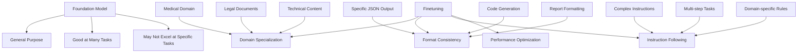
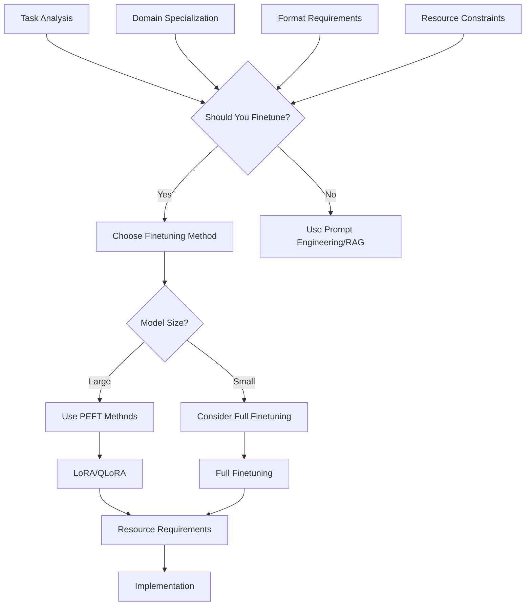
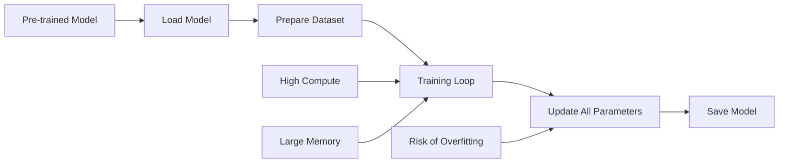
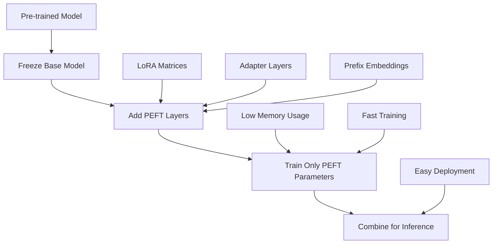
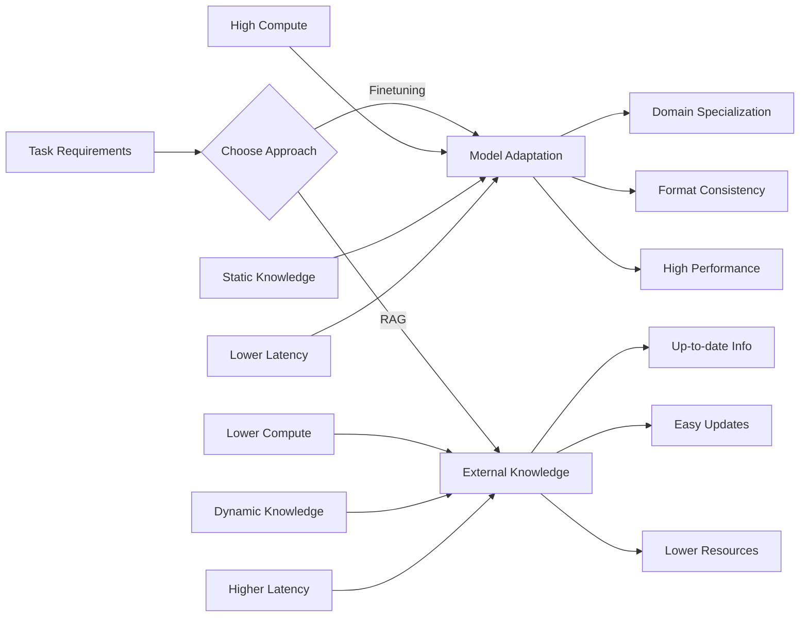
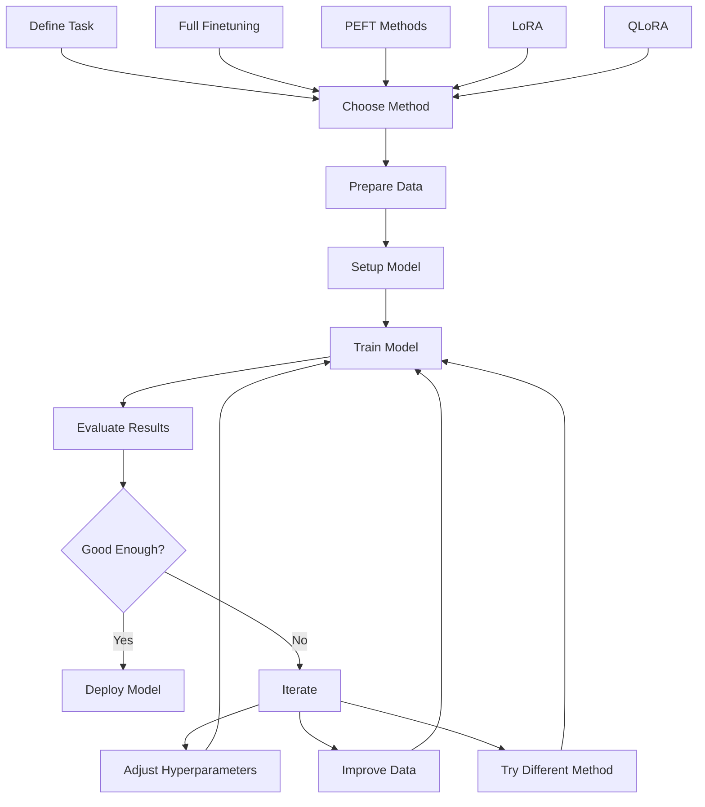

# Chapter 7: Finetuning

## Overview

Finetuning adapts pre-trained foundation models to specific tasks or domains. While prompt engineering and RAG are widely used, finetuning modifies the model itself for better performance on specialized tasks.

## What is Finetuning?

Finetuning involves further training a pre-trained foundation model on task-specific data to improve performance. It adjusts the model's weights to better handle your specific use case.

### Why Finetuning Matters



Foundation models are general-purpose but may not excel at specific tasks. Finetuning bridges this gap by:
- **Domain Adaptation**: Making models work better in specialized fields
- **Format Consistency**: Ensuring outputs match your required structure
- **Instruction Following**: Improving how models follow your specific instructions
- **Performance Optimization**: Achieving better accuracy for your use case

## Finetuning Decision Framework



## When to Finetune

### ✅ Good Candidates for Finetuning

- **Domain Specialization**: Medical, legal, technical, or industry-specific tasks
- **Output Format**: Requiring specific JSON, YAML, or structured outputs
- **Instruction Following**: Complex, domain-specific instructions
- **Consistent Style**: Maintaining specific tone, format, or style
- **Performance Requirements**: High accuracy needed for critical applications

### ❌ When Not to Finetune

- **Resource Constraints**: Limited compute, time, or expertise
- **Task Variability**: Frequently changing requirements
- **Small Datasets**: Insufficient high-quality training data
- **General Tasks**: Tasks well-handled by base models
- **Rapid Prototyping**: Quick iterations and testing

## Finetuning Methods

### 1. Full Finetuning

Updates all model parameters. Most effective but resource-intensive.

**Pros**: Maximum performance improvement, complete adaptation
**Cons**: High computational cost, large memory requirements, risk of catastrophic forgetting

### Full Finetuning Process



### 2. Parameter-Efficient Finetuning (PEFT)

Updates only a small subset of parameters, making finetuning more accessible.

**Methods**:
- **LoRA**: Low-Rank Adaptation - adds small rank decomposition matrices
- **QLoRA**: Quantized LoRA - reduces memory further with quantization
- **Adapter Layers**: Adds small trainable layers between existing layers
- **Prefix Tuning**: Prepends trainable prefixes to input embeddings

### PEFT Process Flow



## Finetuning vs RAG Comparison



## Code Examples

### Prerequisites

```bash
pip install transformers peft torch datasets accelerate
```

### Basic LoRA Finetuning

```python
from transformers import AutoModelForCausalLM, AutoTokenizer, TrainingArguments, Trainer
from peft import get_peft_model, LoraConfig, TaskType
from datasets import Dataset
import torch

# 1. Load pre-trained model
def load_model():
    """Load model and tokenizer"""
    model_name = "facebook/opt-125m"  # Smaller model for demo
    
    tokenizer = AutoTokenizer.from_pretrained(model_name)
    model = AutoModelForCausalLM.from_pretrained(model_name)
    
    # Add padding token if missing
    if tokenizer.pad_token is None:
        tokenizer.pad_token = tokenizer.eos_token
    
    return model, tokenizer

# 2. Setup LoRA configuration
def setup_lora(model):
    """Apply LoRA to the model"""
    
    peft_config = LoraConfig(
        task_type=TaskType.CAUSAL_LM,
        inference_mode=False,
        r=8,  # Rank of adaptation
        lora_alpha=32,  # Scaling factor
        lora_dropout=0.1,  # Dropout for regularization
        target_modules=["q_proj", "v_proj"]  # Which layers to adapt
    )
    
    model = get_peft_model(model, peft_config)
    model.print_trainable_parameters()  # Show what's being trained
    
    return model

# 3. Prepare training data
def prepare_dataset():
    """Create simple training dataset"""
    
    # Example: Instruction-following dataset
    data = {
        "text": [
            "Instruction: Summarize the following text.\nInput: AI is transforming industries.\nOutput: AI changes industries.",
            "Instruction: Translate to French.\nInput: Hello world.\nOutput: Bonjour le monde.",
            "Instruction: Classify sentiment.\nInput: I love this movie!\nOutput: positive"
        ]
    }
    
    dataset = Dataset.from_dict(data)
    return dataset

# 4. Training function
def train_model(model, tokenizer, dataset):
    """Train the model with LoRA"""
    
    def tokenize_function(examples):
        return tokenizer(examples["text"], truncation=True, padding=True, max_length=512)
    
    tokenized_dataset = dataset.map(tokenize_function, batched=True)
    
    training_args = TrainingArguments(
        output_dir="./finetuned_model",
        num_train_epochs=3,
        per_device_train_batch_size=4,
        save_steps=100,
        logging_steps=10,
        learning_rate=2e-4,
        warmup_steps=100,
    )
    
    trainer = Trainer(
        model=model,
        args=training_args,
        train_dataset=tokenized_dataset,
        data_collator=lambda data: {"input_ids": torch.stack([f["input_ids"] for f in data])}
    )
    
    trainer.train()
    return model

# 5. Complete finetuning pipeline
def finetune_pipeline():
    """Complete finetuning pipeline"""
    
    print("Loading model...")
    model, tokenizer = load_model()
    
    print("Setting up LoRA...")
    model = setup_lora(model)
    
    print("Preparing dataset...")
    dataset = prepare_dataset()
    
    print("Starting training...")
    model = train_model(model, tokenizer, dataset)
    
    print("Saving model...")
    model.save_pretrained("./finetuned_model")
    tokenizer.save_pretrained("./finetuned_model")
    
    print("Finetuning complete!")

# Run the pipeline
if __name__ == "__main__":
    finetune_pipeline()
```

**What this code does:**
1. **Loads a pre-trained model** - Uses a smaller model for demonstration
2. **Applies LoRA** - Adds efficient adaptation layers
3. **Prepares training data** - Creates instruction-following examples
4. **Trains the model** - Updates only LoRA parameters
5. **Saves the model** - Stores the finetuned version

### Advanced QLoRA Finetuning

```python
from transformers import BitsAndBytesConfig
from peft import PeftModel

# QLoRA with 4-bit quantization
def setup_qlora():
    """Setup QLoRA with 4-bit quantization"""
    
    # 4-bit quantization config
    bnb_config = BitsAndBytesConfig(
        load_in_4bit=True,
        bnb_4bit_quant_type="nf4",
        bnb_4bit_compute_dtype=torch.float16,
        bnb_4bit_use_double_quant=False,
    )
    
    # Load model with quantization
    model = AutoModelForCausalLM.from_pretrained(
        "facebook/opt-125m",
        quantization_config=bnb_config,
        device_map="auto"
    )
    
    # LoRA config for QLoRA
    peft_config = LoraConfig(
        task_type=TaskType.CAUSAL_LM,
        inference_mode=False,
        r=16,
        lora_alpha=32,
        lora_dropout=0.1,
        target_modules=["q_proj", "v_proj", "k_proj", "o_proj"]
    )
    
    model = get_peft_model(model, peft_config)
    return model

# Load and use finetuned model
def load_finetuned_model():
    """Load a finetuned model for inference"""
    
    base_model = AutoModelForCausalLM.from_pretrained("facebook/opt-125m")
    model = PeftModel.from_pretrained(base_model, "./finetuned_model")
    
    tokenizer = AutoTokenizer.from_pretrained("facebook/opt-125m")
    
    return model, tokenizer

def generate_response(model, tokenizer, prompt):
    """Generate response using finetuned model"""
    
    inputs = tokenizer(prompt, return_tensors="pt")
    
    with torch.no_grad():
        outputs = model.generate(
            **inputs,
            max_length=100,
            temperature=0.7,
            do_sample=True,
            pad_token_id=tokenizer.eos_token_id
        )
    
    response = tokenizer.decode(outputs[0], skip_special_tokens=True)
    return response

# Test the finetuned model
def test_finetuned_model():
    """Test the finetuned model"""
    
    model, tokenizer = load_finetuned_model()
    
    test_prompts = [
        "Instruction: Summarize the following text.\nInput: Machine learning is revolutionizing healthcare.",
        "Instruction: Classify sentiment.\nInput: This product is amazing!"
    ]
    
    for prompt in test_prompts:
        print(f"Prompt: {prompt}")
        response = generate_response(model, tokenizer, prompt)
        print(f"Response: {response}")
        print("---")

if __name__ == "__main__":
    test_finetuned_model()
```

**What this code does:**
1. **Sets up QLoRA** - Uses 4-bit quantization to save memory
2. **Loads finetuned model** - Retrieves the trained model
3. **Generates responses** - Uses the model for inference
4. **Tests performance** - Evaluates the finetuned model

## Finetuning Process Overview



## Best Practices

### 1. Data Quality
- **High-quality data**: Ensure your training data is accurate and relevant
- **Sufficient quantity**: Have enough data for meaningful learning
- **Proper formatting**: Format data consistently with your target task

### 2. Training Strategy
- **Start small**: Begin with smaller models and datasets
- **Monitor metrics**: Track training loss and validation performance
- **Early stopping**: Stop training when performance plateaus
- **Regularization**: Use dropout and other techniques to prevent overfitting

### 3. Resource Management
- **Use PEFT**: Start with parameter-efficient methods like LoRA
- **Gradient checkpointing**: Save memory during training
- **Mixed precision**: Use fp16 or bf16 for faster training
- **Distributed training**: Scale across multiple GPUs when possible

### 4. Evaluation and Deployment
- **Comprehensive testing**: Test on diverse inputs and edge cases
- **Performance comparison**: Compare against baseline models
- **A/B testing**: Test finetuned model against alternatives
- **Monitoring**: Track performance in production

## Key Terms

- **Finetuning**: Adapting pre-trained models to specific tasks
- **Full Finetuning**: Updating all model parameters
- **PEFT**: Parameter-Efficient Fine-Tuning methods
- **LoRA**: Low-Rank Adaptation technique
- **QLoRA**: Quantized LoRA for memory efficiency
- **Catastrophic Forgetting**: Losing general capabilities when finetuning
- **Instruction Tuning**: Training models to follow specific instructions

## Key Takeaways

1. **Finetuning adapts models** - Makes foundation models work better for specific tasks
2. **Choose the right method** - Full finetuning for maximum performance, PEFT for efficiency
3. **Quality data matters** - Good training data is essential for successful finetuning
4. **Monitor and evaluate** - Track performance and compare against baselines
5. **Consider resources** - PEFT methods make finetuning more accessible 