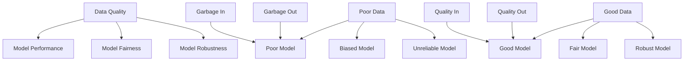
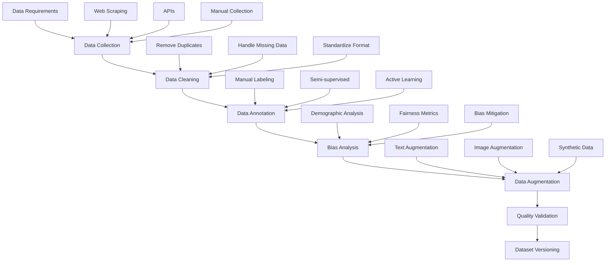
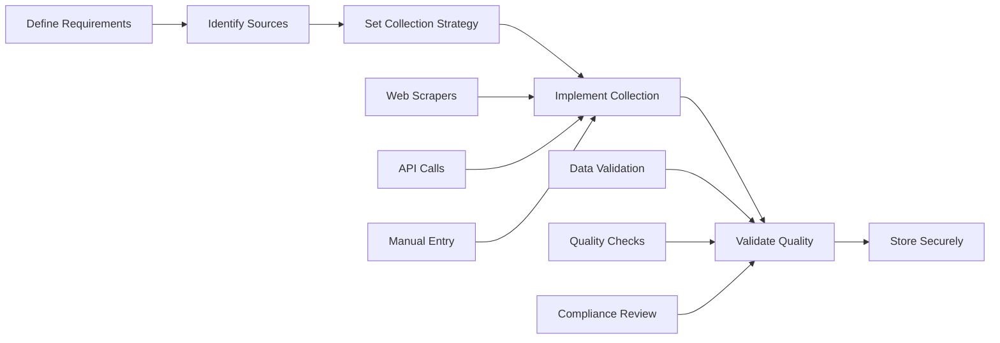
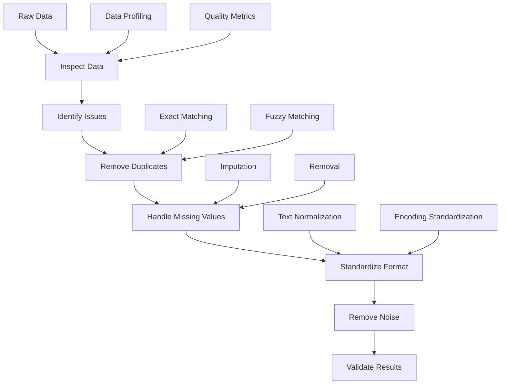
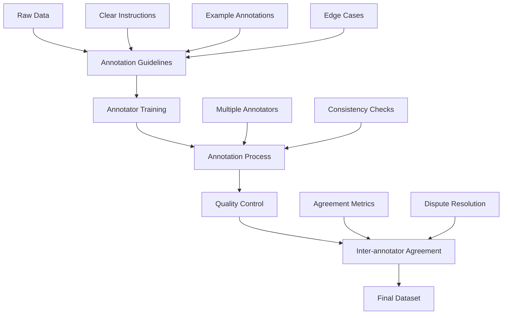
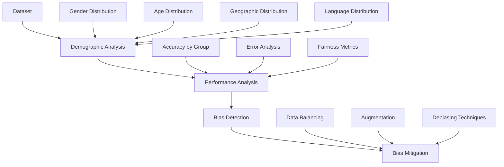
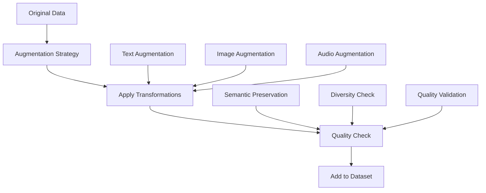
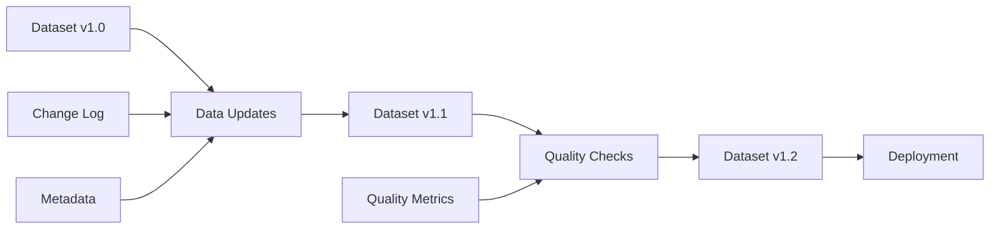

# Chapter 8: Dataset Engineering

## Overview

Dataset engineering is the critical process of collecting, cleaning, annotating, and managing data for AI applications. The quality and characteristics of your training data directly determine model performance, fairness, and robustness.

## What is Dataset Engineering?

Dataset engineering is the systematic process of creating high-quality datasets for AI model training. It involves collecting relevant data, cleaning and preprocessing it, adding annotations, and ensuring the dataset is diverse, balanced, and representative of real-world scenarios.

### Why Dataset Engineering Matters



The quality of your dataset directly impacts your model's performance:
- **Garbage in, garbage out**: Poor data leads to poor model performance
- **Bias amplification**: Biases in data are learned and amplified by models
- **Generalization**: Diverse, well-curated data improves model generalization
- **Fairness**: Balanced datasets help ensure equitable model performance

## Dataset Engineering Pipeline



## Data Collection and Curation

### Data Sources

**Web Data**: Articles, blogs, social media, forums
**Structured Data**: Databases, APIs, CSV files
**Domain-Specific**: Medical records, legal documents, technical manuals
**User-Generated**: Reviews, comments, feedback
**Synthetic Data**: Generated examples for specific scenarios

### Data Collection Process



### Data Collection Code

```python
import requests
import pandas as pd
from bs4 import BeautifulSoup
import json

# 1. Web scraping example
def scrape_web_data(urls):
    """Simple web scraping for text data"""
    
    collected_data = []
    
    for url in urls:
        try:
            response = requests.get(url)
            soup = BeautifulSoup(response.content, 'html.parser')
            
            # Extract text content
            text = soup.get_text()
            
            collected_data.append({
                'url': url,
                'text': text,
                'timestamp': pd.Timestamp.now()
            })
            
        except Exception as e:
            print(f"Error scraping {url}: {e}")
    
    return collected_data

# 2. API data collection
def collect_api_data(api_url, params):
    """Collect data from APIs"""
    
    try:
        response = requests.get(api_url, params=params)
        data = response.json()
        
        return data
    
    except Exception as e:
        print(f"Error collecting API data: {e}")
        return None

# 3. Combine multiple sources
def create_dataset():
    """Create dataset from multiple sources"""
    
    # Web scraping
    urls = [
        "https://example.com/article1",
        "https://example.com/article2"
    ]
    web_data = scrape_web_data(urls)
    
    # API data
    api_data = collect_api_data(
        "https://api.example.com/data",
        {"limit": 100}
    )
    
    # Combine and save
    dataset = {
        'web_data': web_data,
        'api_data': api_data
    }
    
    with open('raw_dataset.json', 'w') as f:
        json.dump(dataset, f, indent=2)
    
    return dataset
```

**What this code does:**
1. **Scrapes web data** - Extracts text from websites
2. **Collects API data** - Fetches data from APIs
3. **Combines sources** - Merges different data types
4. **Saves dataset** - Stores data for later use

## Data Cleaning and Preprocessing

### Common Data Issues

- **Duplicates**: Identical or near-identical entries
- **Missing Values**: Incomplete data entries
- **Inconsistent Formatting**: Different formats for same data
- **Noise**: Irrelevant or low-quality content
- **Outliers**: Unusual or erroneous data points

### Data Cleaning Process



### Data Cleaning Code

```python
import pandas as pd
import numpy as np
from sklearn.feature_extraction.text import TfidfVectorizer
from sklearn.metrics.pairwise import cosine_similarity

# 1. Basic data cleaning
def clean_dataset(data):
    """Basic data cleaning operations"""
    
    # Convert to DataFrame if needed
    if isinstance(data, list):
        df = pd.DataFrame(data)
    else:
        df = data.copy()
    
    # Remove duplicates
    df = df.drop_duplicates()
    
    # Handle missing values
    df = df.dropna(subset=['text'])  # Remove rows with missing text
    
    # Standardize text
    df['text'] = df['text'].str.lower()  # Convert to lowercase
    df['text'] = df['text'].str.strip()  # Remove extra whitespace
    
    # Remove very short or very long texts
    df = df[df['text'].str.len() > 10]  # Remove very short texts
    df = df[df['text'].str.len() < 10000]  # Remove very long texts
    
    return df

# 2. Remove near-duplicates using similarity
def remove_near_duplicates(df, similarity_threshold=0.8):
    """Remove near-duplicate texts using TF-IDF similarity"""
    
    # Create TF-IDF vectors
    tfidf = TfidfVectorizer(max_features=1000, stop_words='english')
    tfidf_matrix = tfidf.fit_transform(df['text'])
    
    # Calculate cosine similarity
    similarity_matrix = cosine_similarity(tfidf_matrix)
    
    # Find duplicates
    duplicates = []
    for i in range(len(similarity_matrix)):
        for j in range(i+1, len(similarity_matrix)):
            if similarity_matrix[i][j] > similarity_threshold:
                duplicates.append(j)
    
    # Remove duplicates
    df_clean = df.drop(df.index[duplicates])
    
    return df_clean

# 3. Complete cleaning pipeline
def clean_pipeline(raw_data):
    """Complete data cleaning pipeline"""
    
    print("Starting data cleaning...")
    
    # Basic cleaning
    df = clean_dataset(raw_data)
    print(f"After basic cleaning: {len(df)} samples")
    
    # Remove near-duplicates
    df = remove_near_duplicates(df)
    print(f"After removing duplicates: {len(df)} samples")
    
    # Final validation
    df = df.reset_index(drop=True)
    
    print("Data cleaning complete!")
    return df
```

**What this code does:**
1. **Removes duplicates** - Eliminates exact and near-duplicate entries
2. **Handles missing data** - Removes or fills missing values
3. **Standardizes format** - Normalizes text formatting
4. **Removes noise** - Filters out low-quality content

## Data Annotation

### Annotation Types

- **Classification**: Assigning categories or labels
- **Sentiment Analysis**: Positive, negative, neutral
- **Named Entity Recognition**: Identifying people, places, organizations
- **Text Generation**: Creating summaries, translations, or responses

### Annotation Process



### Annotation Code

```python
import pandas as pd
from sklearn.model_selection import train_test_split

# 1. Simple annotation function
def annotate_sentiment(text):
    """Simple rule-based sentiment annotation"""
    
    positive_words = ['good', 'great', 'excellent', 'amazing', 'love', 'like']
    negative_words = ['bad', 'terrible', 'awful', 'hate', 'dislike', 'poor']
    
    text_lower = text.lower()
    
    positive_count = sum(1 for word in positive_words if word in text_lower)
    negative_count = sum(1 for word in negative_words if word in text_lower)
    
    if positive_count > negative_count:
        return 'positive'
    elif negative_count > positive_count:
        return 'negative'
    else:
        return 'neutral'

# 2. Create annotated dataset
def create_annotated_dataset(texts):
    """Create annotated dataset from texts"""
    
    annotations = []
    
    for text in texts:
        sentiment = annotate_sentiment(text)
        annotations.append({
            'text': text,
            'sentiment': sentiment
        })
    
    return pd.DataFrame(annotations)

# 3. Split dataset
def split_dataset(df, test_size=0.2, val_size=0.1):
    """Split dataset into train, validation, and test sets"""
    
    # First split: train+val and test
    train_val, test = train_test_split(df, test_size=test_size, random_state=42)
    
    # Second split: train and validation
    train, val = train_test_split(train_val, test_size=val_size, random_state=42)
    
    return train, val, test

# 4. Complete annotation pipeline
def annotation_pipeline(raw_texts):
    """Complete annotation pipeline"""
    
    print("Starting annotation...")
    
    # Create annotated dataset
    df = create_annotated_dataset(raw_texts)
    print(f"Annotated {len(df)} samples")
    
    # Split dataset
    train, val, test = split_dataset(df)
    print(f"Train: {len(train)}, Val: {len(val)}, Test: {len(test)}")
    
    # Save datasets
    train.to_csv('train.csv', index=False)
    val.to_csv('val.csv', index=False)
    test.to_csv('test.csv', index=False)
    
    print("Annotation pipeline complete!")
    return train, val, test
```

**What this code does:**
1. **Annotates data** - Adds labels to raw text
2. **Creates datasets** - Organizes data with annotations
3. **Splits data** - Creates train/validation/test sets
4. **Saves results** - Stores processed datasets

## Bias Analysis and Mitigation

### Bias Detection



### Bias Mitigation Code

```python
import pandas as pd
from collections import Counter

# 1. Analyze dataset bias
def analyze_bias(df, demographic_column):
    """Analyze bias in dataset"""
    
    # Count distribution
    distribution = Counter(df[demographic_column])
    
    print(f"Distribution of {demographic_column}:")
    for group, count in distribution.items():
        percentage = (count / len(df)) * 100
        print(f"  {group}: {count} ({percentage:.1f}%)")
    
    return distribution

# 2. Balance dataset
def balance_dataset(df, target_column, demographic_column):
    """Balance dataset across demographic groups"""
    
    # Find minimum count across groups
    group_counts = df[demographic_column].value_counts()
    min_count = group_counts.min()
    
    balanced_df = pd.DataFrame()
    
    for group in df[demographic_column].unique():
        group_data = df[df[demographic_column] == group]
        
        if len(group_data) > min_count:
            # Sample to match minimum count
            balanced_group = group_data.sample(n=min_count, random_state=42)
        else:
            balanced_group = group_data
        
        balanced_df = pd.concat([balanced_df, balanced_group])
    
    return balanced_df.reset_index(drop=True)

# 3. Bias mitigation pipeline
def bias_mitigation_pipeline(df):
    """Complete bias mitigation pipeline"""
    
    print("Analyzing bias...")
    
    # Analyze original bias
    original_dist = analyze_bias(df, 'demographic')
    
    # Balance dataset
    balanced_df = balance_dataset(df, 'sentiment', 'demographic')
    
    print("\nAfter balancing:")
    balanced_dist = analyze_bias(balanced_df, 'demographic')
    
    return balanced_df
```

**What this code does:**
1. **Analyzes bias** - Checks distribution across demographic groups
2. **Balances data** - Ensures equal representation
3. **Mitigates bias** - Reduces unfair treatment

## Data Augmentation

### Augmentation Techniques

- **Text Augmentation**: Synonym replacement, back-translation, paraphrasing
- **Image Augmentation**: Rotation, scaling, color changes
- **Audio Augmentation**: Speed changes, noise addition, pitch shifts

### Augmentation Process



## Dataset Versioning and Management

### Version Control



## Best Practices

### 1. Data Quality
- **Validate data sources**: Ensure data comes from reliable sources
- **Check for biases**: Analyze demographic and content biases
- **Maintain consistency**: Use consistent formats and standards
- **Document everything**: Keep detailed records of data processing

### 2. Annotation Quality
- **Clear guidelines**: Provide detailed annotation instructions
- **Multiple annotators**: Use several people for important annotations
- **Quality control**: Check inter-annotator agreement
- **Iterative improvement**: Refine guidelines based on results

### 3. Bias Mitigation
- **Diverse sources**: Collect data from various sources
- **Balanced representation**: Ensure equal representation across groups
- **Regular audits**: Periodically check for biases
- **Transparent reporting**: Document bias analysis and mitigation efforts

### 4. Data Management
- **Version control**: Track changes to datasets
- **Metadata**: Maintain detailed information about data
- **Security**: Protect sensitive data appropriately
- **Accessibility**: Make data easily accessible to team members

## Key Terms

- **Dataset Engineering**: Systematic process of creating high-quality datasets
- **Data Cleaning**: Removing errors, duplicates, and inconsistencies
- **Data Annotation**: Adding labels or metadata to data
- **Bias Analysis**: Identifying unfair treatment in datasets
- **Data Augmentation**: Creating additional training examples
- **Inter-annotator Agreement**: Measure of consistency between annotators
- **Data Versioning**: Tracking changes to datasets over time

## Key Takeaways

1. **Quality data is essential** - Poor data leads to poor model performance
2. **Clean systematically** - Use structured approaches for data cleaning
3. **Annotate carefully** - Good annotations require clear guidelines and quality control
4. **Check for bias** - Analyze and mitigate biases in your data
5. **Version your data** - Track changes and maintain data lineage
6. **Document everything** - Keep detailed records of data processing steps 