# Chapter 9: Inference Optimization

## Overview

Inference optimization makes AI models run faster, use less memory, and cost less in production. Since inference can account for 90% of ML costs, optimization is crucial for real-world applications.

## What is Inference Optimization?

Inference optimization improves how AI models make predictions in production. It focuses on speed, efficiency, and cost reduction while maintaining accuracy.

### Why Inference Optimization Matters

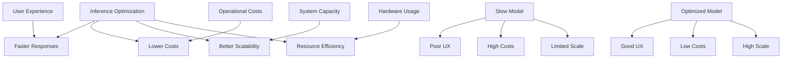

**Performance**: Users expect fast responses
**Cost**: Running large models is expensive
**Scalability**: Efficient inference serves more users
**Resource Efficiency**: Better hardware utilization

## Inference Optimization Overview

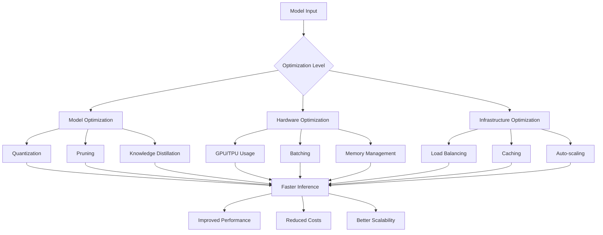

## Core Bottlenecks in Inference

### 1. Compute-Bound Bottlenecks
Tasks limited by processing power (complex matrix operations)

### 2. Memory-Bound Bottlenecks
Tasks limited by data transfer between memory and processors

### Bottleneck Analysis Flow

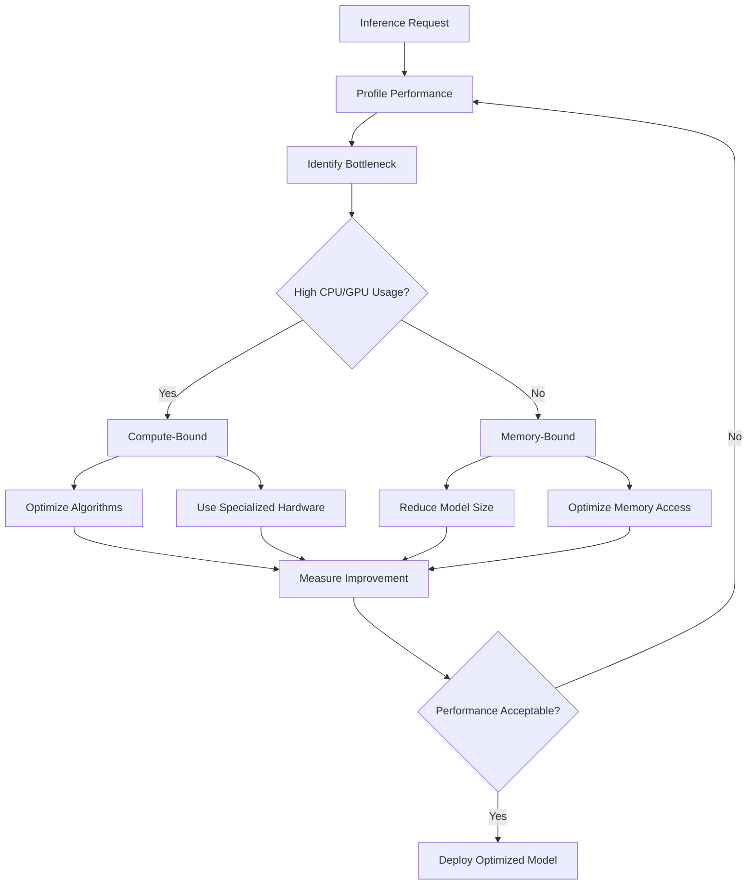

## Key Performance Metrics

### 1. Time to First Token (TTFT)
Time to start generating output after receiving input
**Target**: < 100ms for good user experience

### 2. Time per Output Token (TPOT)
Time to generate each subsequent token
**Target**: 10-50ms per token

### 3. Throughput
Number of requests processed per unit time
**Target**: Maximize while maintaining acceptable latency

### Performance Metrics Dashboard

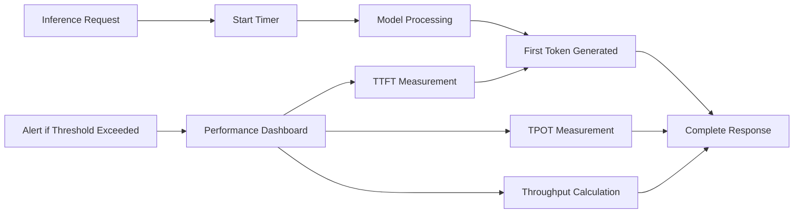

## Model Optimization Techniques

### 1. Quantization

Reducing model precision to speed up computation and reduce memory usage.

**Types**:
- **Post-training Quantization**: Quantize after training
- **Quantization-Aware Training**: Train with quantization in mind
- **Dynamic Quantization**: Quantize on-the-fly during inference

### Quantization Process

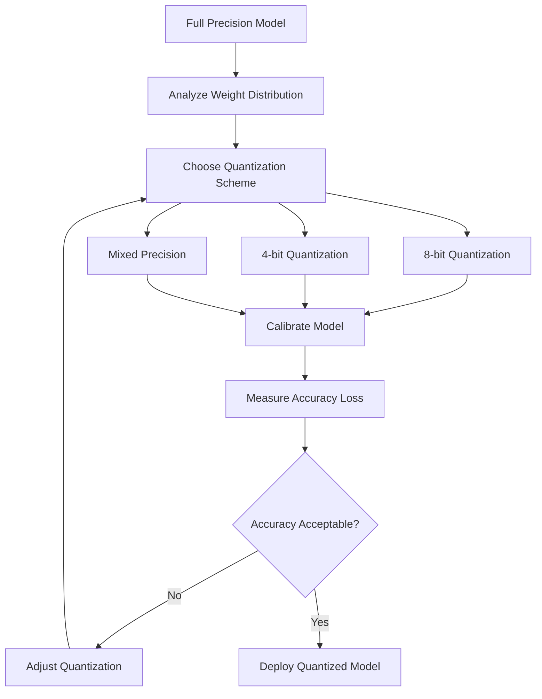

### 2. Pruning

Removing less important model weights to shrink the model and speed up inference.

**Types**:
- **Structured Pruning**: Remove entire layers or channels
- **Unstructured Pruning**: Remove individual weights
- **Magnitude-based Pruning**: Remove weights with smallest magnitudes

### Pruning Process

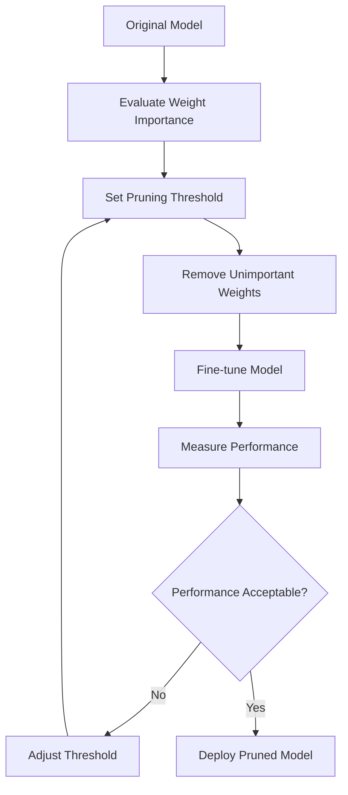

## Practical Implementation

Here's how to implement basic inference optimization:

```python
import torch
import torch.nn as nn
from transformers import AutoModelForCausalLM, AutoTokenizer
import time

# 1. Basic model loading
def load_model():
    """Load a foundation model"""
    model_name = "facebook/opt-125m"  # Smaller model for demo
    
    tokenizer = AutoTokenizer.from_pretrained(model_name)
    model = AutoModelForCausalLM.from_pretrained(model_name)
    
    return model, tokenizer

# 2. Quantization
def quantize_model(model):
    """Apply dynamic quantization to model"""
    
    # Dynamic quantization (8-bit)
    quantized_model = torch.quantization.quantize_dynamic(
        model, 
        {nn.Linear}, 
        dtype=torch.qint8
    )
    
    return quantized_model

# 3. Performance measurement
def measure_performance(model, tokenizer, text, num_runs=10):
    """Measure inference performance"""
    
    # Tokenize input
    inputs = tokenizer(text, return_tensors="pt")
    
    # Warm up
    with torch.no_grad():
        _ = model.generate(**inputs, max_length=50)
    
    # Measure performance
    times = []
    for _ in range(num_runs):
        start_time = time.time()
        
        with torch.no_grad():
            outputs = model.generate(**inputs, max_length=50)
        
        end_time = time.time()
        times.append(end_time - start_time)
    
    avg_time = sum(times) / len(times)
    throughput = 1 / avg_time
    
    return avg_time, throughput

# 4. Batching for throughput
def batch_inference(model, tokenizer, texts, batch_size=4):
    """Process multiple requests in batches"""
    
    all_outputs = []
    
    for i in range(0, len(texts), batch_size):
        batch_texts = texts[i:i + batch_size]
        
        # Tokenize batch
        inputs = tokenizer(batch_texts, return_tensors="pt", padding=True)
        
        # Generate
        with torch.no_grad():
            outputs = model.generate(**inputs, max_length=50)
        
        # Decode outputs
        batch_outputs = [tokenizer.decode(output, skip_special_tokens=True) 
                        for output in outputs]
        all_outputs.extend(batch_outputs)
    
    return all_outputs

# 5. Complete optimization pipeline
def optimization_pipeline():
    """Complete inference optimization pipeline"""
    
    print("Loading model...")
    model, tokenizer = load_model()
    
    # Test original model
    test_text = "The future of artificial intelligence is"
    print(f"Testing with: {test_text}")
    
    original_time, original_throughput = measure_performance(
        model, tokenizer, test_text
    )
    print(f"Original model - Time: {original_time:.3f}s, Throughput: {original_throughput:.2f} req/s")
    
    # Quantize model
    print("\nQuantizing model...")
    quantized_model = quantize_model(model)
    
    quantized_time, quantized_throughput = measure_performance(
        quantized_model, tokenizer, test_text
    )
    print(f"Quantized model - Time: {quantized_time:.3f}s, Throughput: {quantized_throughput:.2f} req/s")
    
    # Test batching
    print("\nTesting batch inference...")
    test_texts = [
        "The future of artificial intelligence is",
        "Machine learning applications include",
        "Deep learning models can",
        "Natural language processing enables"
    ]
    
    start_time = time.time()
    batch_outputs = batch_inference(model, tokenizer, test_texts, batch_size=4)
    batch_time = time.time() - start_time
    
    print(f"Batch processing - Time: {batch_time:.3f}s for {len(test_texts)} requests")
    print(f"Batch throughput: {len(test_texts)/batch_time:.2f} req/s")
    
    # Show improvements
    speedup = original_time / quantized_time
    print(f"\nQuantization speedup: {speedup:.2f}x")
    
    return model, quantized_model

# Run the pipeline
if __name__ == "__main__":
    original_model, optimized_model = optimization_pipeline()
```

**What this code does:**
1. **Loads a model** - Uses a smaller model for demonstration
2. **Applies quantization** - Reduces precision to speed up inference
3. **Measures performance** - Tracks time and throughput
4. **Tests batching** - Processes multiple requests efficiently
5. **Shows improvements** - Compares optimized vs original performance

## Hardware and Infrastructure Optimization

### GPU/TPU Optimization

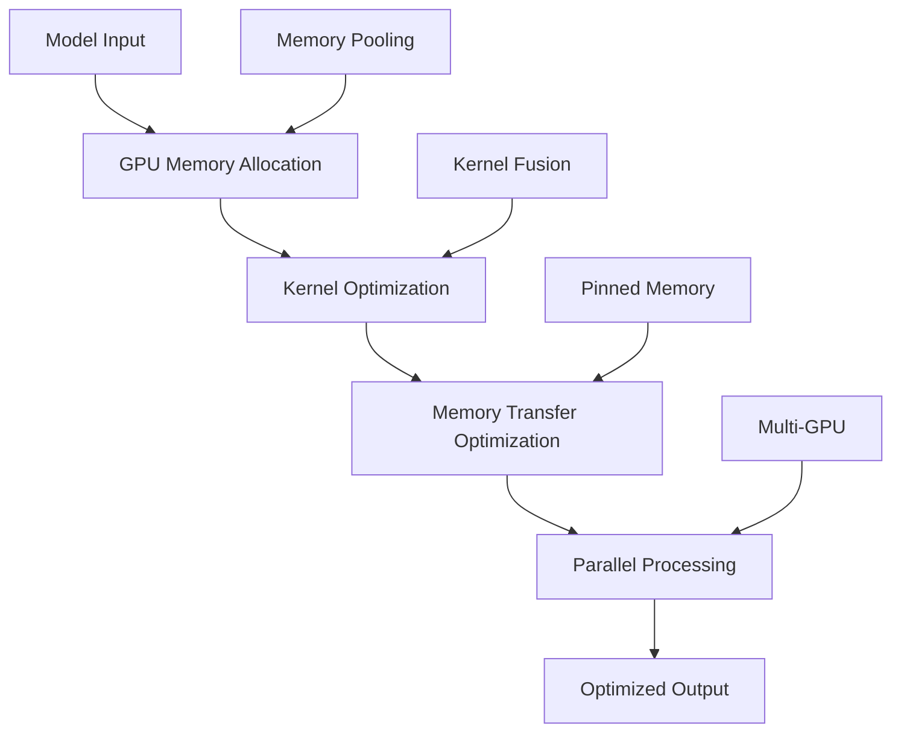

### Batching Strategies

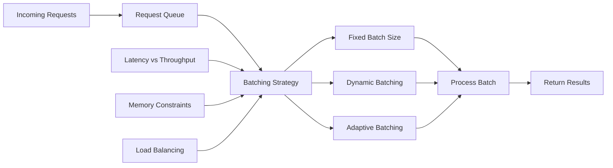

## Advanced Optimization Techniques

### 1. Knowledge Distillation

Training a smaller model to mimic a larger model's behavior.

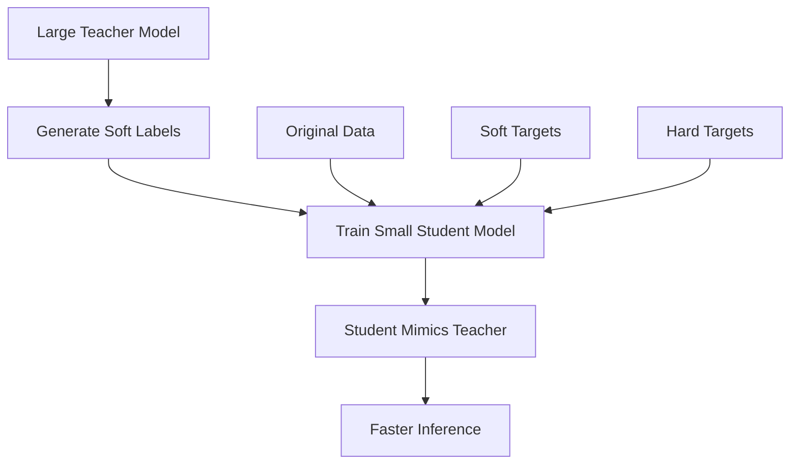

### 2. Model Architecture Optimization

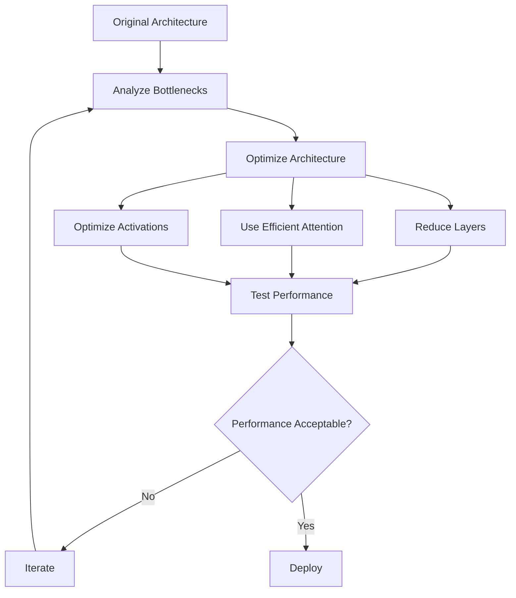

## Monitoring and Optimization

### Performance Monitoring

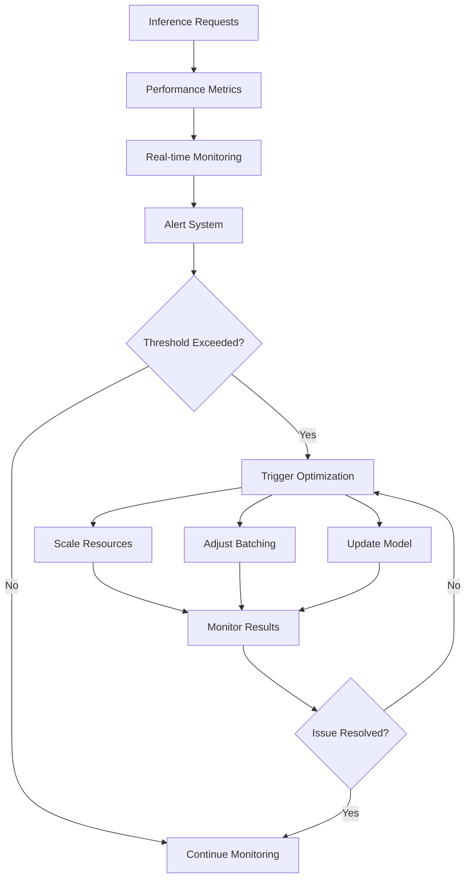

## Best Practices

### 1. Model Optimization
- **Start with quantization** - Easy wins with minimal accuracy loss
- **Use appropriate precision** - Balance speed vs accuracy
- **Profile before optimizing** - Identify actual bottlenecks
- **Test thoroughly** - Ensure optimizations don't break functionality

### 2. Infrastructure Optimization
- **Use appropriate hardware** - GPUs for compute, optimized CPUs for memory
- **Implement caching** - Cache frequently requested results
- **Optimize batching** - Balance latency vs throughput
- **Monitor continuously** - Track performance metrics

### 3. Cost Optimization
- **Right-size resources** - Don't over-provision
- **Use spot instances** - For non-critical workloads
- **Optimize data transfer** - Minimize network costs
- **Monitor usage** - Track and optimize costs

## Key Terms

- **Inference**: Making predictions with trained models
- **Quantization**: Reducing model precision for speed
- **Pruning**: Removing unimportant model weights
- **Batching**: Processing multiple requests together
- **TTFT**: Time to First Token
- **TPOT**: Time per Output Token
- **Throughput**: Requests processed per unit time
- **Knowledge Distillation**: Training smaller models to mimic larger ones

## Key Takeaways

1. **Optimize systematically** - Profile first, then apply targeted optimizations
2. **Balance trade-offs** - Speed vs accuracy, latency vs throughput
3. **Monitor continuously** - Track performance metrics in production
4. **Use appropriate techniques** - Different optimizations for different bottlenecks
5. **Test thoroughly** - Ensure optimizations maintain model quality 