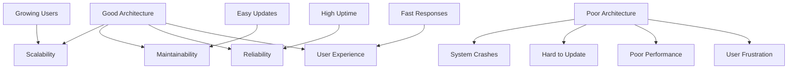
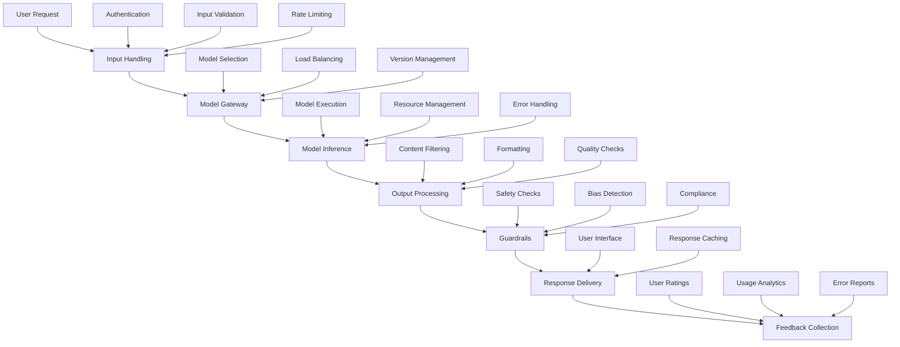
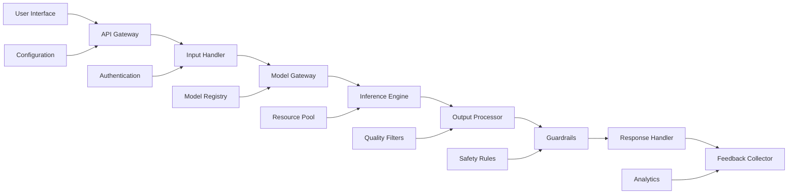
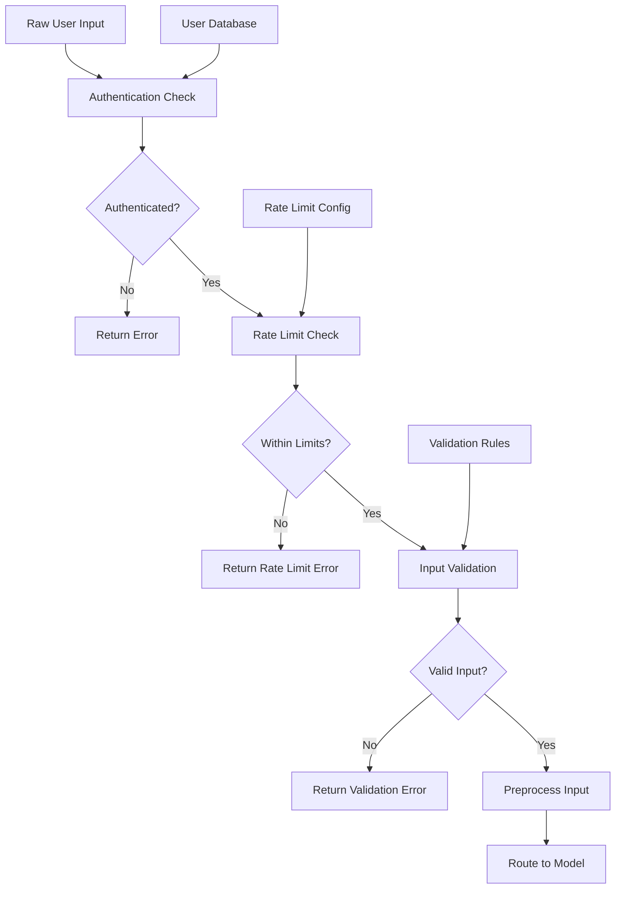
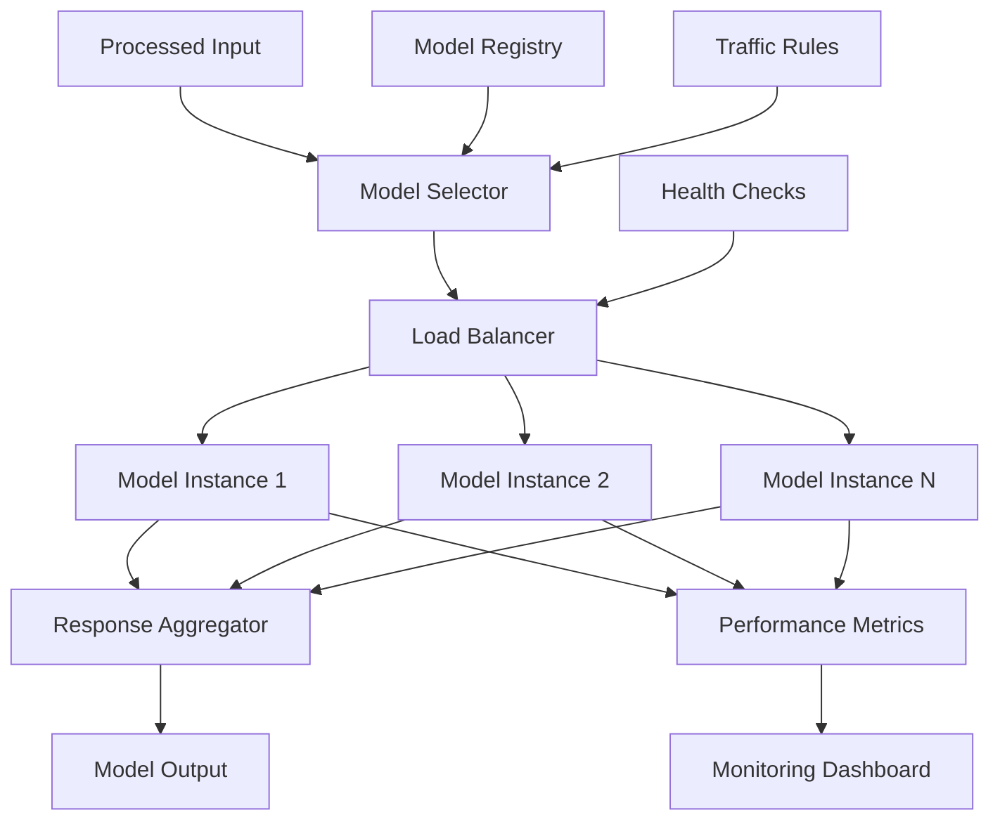
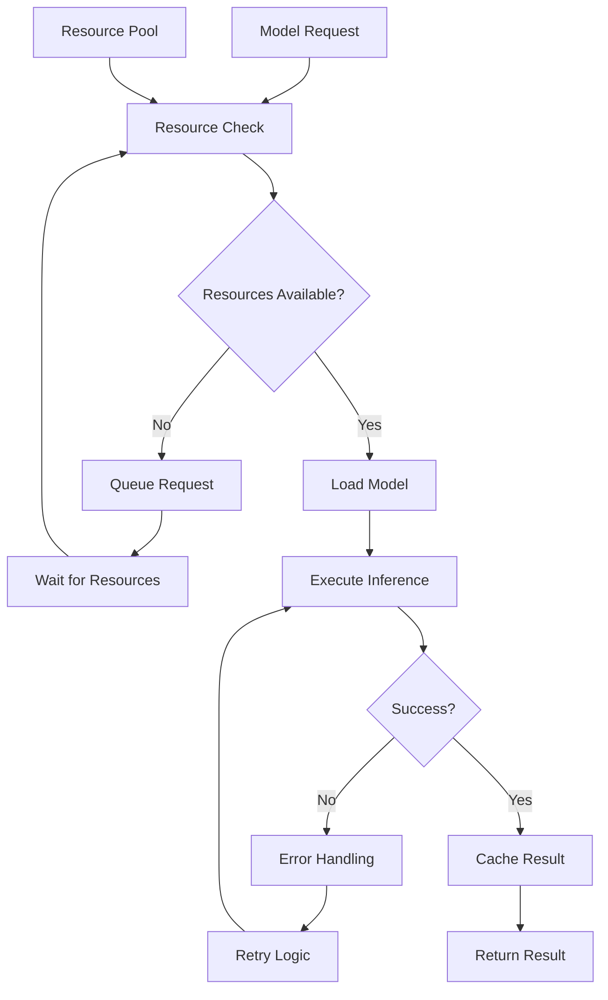
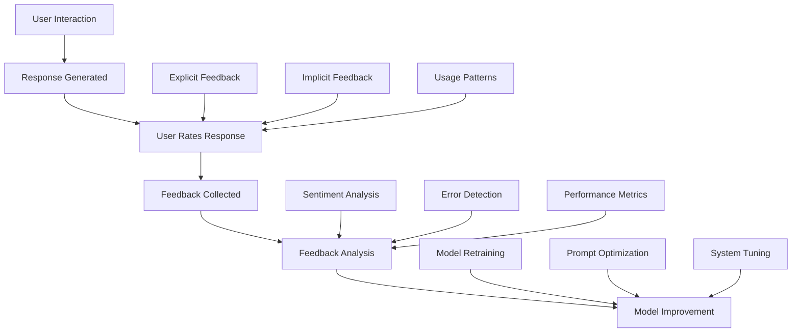
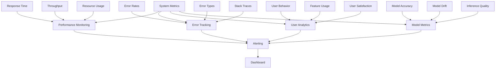
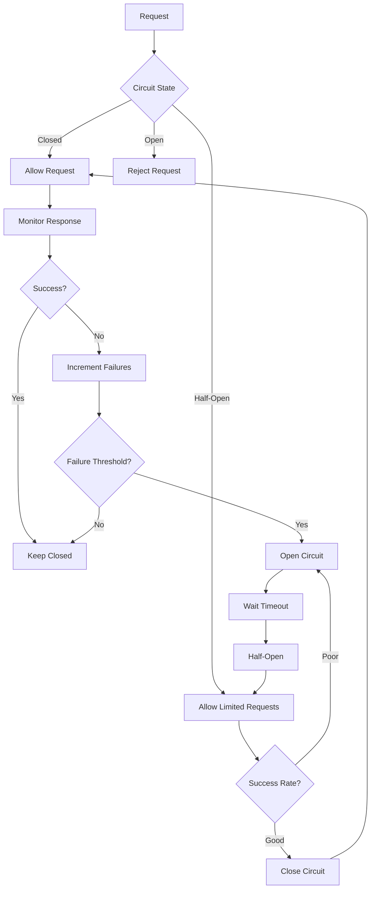

# Chapter 10: AI Engineering Architecture and User Feedback

## Overview

This chapter shows how to build complete AI applications with foundation models. We'll cover system architecture, modular design, monitoring, and using user feedback to continuously improve your AI systems.

## What is AI Engineering Architecture?

AI Engineering Architecture is designing AI applications that are scalable, maintainable, and reliable. It creates modular systems that handle foundation model complexities while providing smooth user experiences.

### Why Architecture Matters



**Scalability**: Handle growing user demands
**Maintainability**: Easy to update and debug
**Reliability**: Reduce failures and improve uptime
**User Experience**: Fast, consistent, reliable responses

## AI Engineering Architecture Overview



## Modular Design Principles

### 1. Separation of Concerns
Each component has a specific responsibility:
- **Input Handling**: Validation, preprocessing, authentication
- **Model Management**: Selection, versioning, deployment
- **Inference Engine**: Model execution, resource management
- **Output Processing**: Formatting, filtering, quality checks
- **Guardrails**: Safety, bias detection, compliance
- **Feedback System**: Collection, analysis, improvement

### 2. Loose Coupling
Components interact through well-defined interfaces

### 3. High Cohesion
Related functionality is grouped together

### Modular Architecture Flow



## Core Architecture Components

### 1. Input Handling

**Responsibilities**:
- Validate user inputs
- Authenticate users
- Rate limiting
- Input preprocessing
- Request routing

### Input Handling Process



### 2. Model Gateway

**Responsibilities**:
- Model selection and routing
- Load balancing
- Version management
- Model health monitoring
- A/B testing

### Model Gateway Architecture



### 3. Inference Engine

**Responsibilities**:
- Model execution
- Resource management
- Error handling
- Performance optimization
- Caching

### Inference Engine Flow



## Practical Implementation

Here's a simple AI application architecture:

```python
import time
import json
from typing import Dict, Any, Optional
from transformers import AutoModelForCausalLM, AutoTokenizer

# 1. Input Handler
class InputHandler:
    """Handles user input validation and preprocessing"""
    
    def __init__(self):
        self.rate_limits = {}
        self.max_requests_per_minute = 10
    
    def validate_input(self, user_input: str, user_id: str) -> Dict[str, Any]:
        """Validate and preprocess user input"""
        
        # Check rate limiting
        if not self._check_rate_limit(user_id):
            return {"error": "Rate limit exceeded"}
        
        # Validate input
        if not user_input or len(user_input.strip()) == 0:
            return {"error": "Empty input"}
        
        if len(user_input) > 1000:
            return {"error": "Input too long"}
        
        # Preprocess input
        processed_input = user_input.strip()
        
        return {
            "success": True,
            "processed_input": processed_input,
            "user_id": user_id
        }
    
    def _check_rate_limit(self, user_id: str) -> bool:
        """Simple rate limiting implementation"""
        current_time = time.time()
        
        if user_id not in self.rate_limits:
            self.rate_limits[user_id] = []
        
        # Remove old requests
        self.rate_limits[user_id] = [
            req_time for req_time in self.rate_limits[user_id]
            if current_time - req_time < 60
        ]
        
        # Check if under limit
        if len(self.rate_limits[user_id]) >= self.max_requests_per_minute:
            return False
        
        # Add current request
        self.rate_limits[user_id].append(current_time)
        return True

# 2. Model Gateway
class ModelGateway:
    """Manages model selection and routing"""
    
    def __init__(self):
        self.models = {}
        self.active_model = None
    
    def register_model(self, name: str, model, tokenizer):
        """Register a model"""
        self.models[name] = {
            "model": model,
            "tokenizer": tokenizer,
            "status": "active"
        }
        
        if not self.active_model:
            self.active_model = name
    
    def get_model(self, model_name: Optional[str] = None):
        """Get model for inference"""
        name = model_name or self.active_model
        
        if name not in self.models:
            raise ValueError(f"Model {name} not found")
        
        model_info = self.models[name]
        if model_info["status"] != "active":
            raise ValueError(f"Model {name} is not active")
        
        return model_info["model"], model_info["tokenizer"]

# 3. Inference Engine
class InferenceEngine:
    """Handles model inference with error handling and caching"""
    
    def __init__(self):
        self.cache = {}
        self.max_cache_size = 1000
    
    def infer(self, model, tokenizer, input_text: str) -> Dict[str, Any]:
        """Perform inference with caching and error handling"""
        
        # Check cache
        cache_key = f"{input_text}_{model.__class__.__name__}"
        if cache_key in self.cache:
            return {"success": True, "result": self.cache[cache_key], "cached": True}
        
        try:
            # Prepare input
            inputs = tokenizer(input_text, return_tensors="pt", truncation=True, max_length=512)
            
            # Perform inference
            with torch.no_grad():
                outputs = model.generate(
                    **inputs,
                    max_length=100,
                    do_sample=True,
                    temperature=0.7,
                    pad_token_id=tokenizer.eos_token_id
                )
            
            # Decode output
            result = tokenizer.decode(outputs[0], skip_special_tokens=True)
            
            # Cache result
            self._add_to_cache(cache_key, result)
            
            return {"success": True, "result": result, "cached": False}
            
        except Exception as e:
            return {"success": False, "error": str(e)}
    
    def _add_to_cache(self, key: str, value: str):
        """Add result to cache with size management"""
        if len(self.cache) >= self.max_cache_size:
            # Remove oldest entry
            oldest_key = next(iter(self.cache))
            del self.cache[oldest_key]
        
        self.cache[key] = value

# 4. Complete AI Application
class AIApplication:
    """Complete AI application with all components"""
    
    def __init__(self):
        self.input_handler = InputHandler()
        self.model_gateway = ModelGateway()
        self.inference_engine = InferenceEngine()
    
    def process_request(self, user_input: str, user_id: str) -> Dict[str, Any]:
        """Process a complete user request"""
        
        # Generate request ID
        request_id = f"req_{int(time.time())}"
        
        # 1. Input handling
        input_result = self.input_handler.validate_input(user_input, user_id)
        if not input_result.get("success"):
            return input_result
        
        # 2. Get model
        try:
            model, tokenizer = self.model_gateway.get_model()
        except Exception as e:
            return {"error": f"Model error: {str(e)}"}
        
        # 3. Inference
        inference_result = self.inference_engine.infer(
            model, tokenizer, input_result["processed_input"]
        )
        if not inference_result["success"]:
            return inference_result
        
        # 4. Return response
        return {
            "success": True,
            "request_id": request_id,
            "output": inference_result["result"],
            "cached": inference_result.get("cached", False)
        }

# 5. Usage Example
def run_ai_application():
    """Run the complete AI application"""
    
    # Initialize application
    app = AIApplication()
    
    # Load and register model
    print("Loading model...")
    model_name = "facebook/opt-125m"
    model = AutoModelForCausalLM.from_pretrained(model_name)
    tokenizer = AutoTokenizer.from_pretrained(model_name)
    
    app.model_gateway.register_model("default", model, tokenizer)
    
    # Test requests
    test_requests = [
        ("Hello, how are you?", "user1"),
        ("What is artificial intelligence?", "user1"),
        ("Tell me a joke", "user2")
    ]
    
    for user_input, user_id in test_requests:
        print(f"\nProcessing: {user_input}")
        
        # Process request
        result = app.process_request(user_input, user_id)
        
        if result["success"]:
            print(f"Response: {result['output']}")
        else:
            print(f"Error: {result['error']}")

if __name__ == "__main__":
    run_ai_application()
```

**What this code does:**
1. **Input Handler** - Validates and preprocesses user inputs
2. **Model Gateway** - Manages model selection and routing
3. **Inference Engine** - Handles model execution with caching
4. **Complete Application** - Orchestrates all components

## User Feedback Systems

### Feedback Collection Flow



### Feedback Types

**Explicit Feedback**:
- User ratings (1-5 stars)
- Thumbs up/down
- Written comments
- Error reports

**Implicit Feedback**:
- Click-through rates
- Time spent on responses
- User engagement patterns
- Abandonment rates

## Monitoring and Observability

### Monitoring Components



### Key Metrics to Monitor

**Performance Metrics**:
- Response time (latency)
- Throughput (requests/second)
- Error rates
- Resource utilization

**Quality Metrics**:
- Model accuracy
- User satisfaction scores
- Content quality ratings
- Safety violation rates

## Failure Detection and Recovery

### Circuit Breaker Pattern



### Error Handling Strategies

**Retry Logic**: Automatically retry failed requests
**Fallback Responses**: Provide alternative responses when models fail
**Graceful Degradation**: Reduce functionality rather than failing completely
**User Communication**: Inform users about issues and expected resolution

## Best Practices

### 1. Architecture Design
- **Start simple**: Begin with basic components and add complexity
- **Plan for scale**: Design with growth in mind
- **Use proven patterns**: Leverage established architectural patterns
- **Document everything**: Maintain clear documentation

### 2. Monitoring and Feedback
- **Monitor everything**: Track all important metrics
- **Collect diverse feedback**: Use multiple feedback channels
- **Act on feedback**: Use feedback to drive improvements
- **Measure impact**: Track the effect of changes

### 3. Reliability and Safety
- **Implement guardrails**: Protect against harmful outputs
- **Handle failures gracefully**: Plan for and handle errors
- **Test thoroughly**: Test all components and integrations
- **Monitor continuously**: Keep systems under constant observation

### 4. User Experience
- **Fast responses**: Optimize for speed
- **Clear communication**: Help users understand what's happening
- **Handle errors gracefully**: Provide helpful error messages
- **Gather feedback**: Make it easy for users to provide feedback

## Key Terms

- **AI Engineering Architecture**: Systematic design of AI applications
- **Modular Design**: Breaking systems into independent components
- **Separation of Concerns**: Each component has specific responsibilities
- **Circuit Breaker**: Pattern for handling failures gracefully
- **User Feedback**: Information from users about system performance
- **Monitoring**: Tracking system performance and health
- **Observability**: Understanding system behavior through metrics

## Key Takeaways

1. **Design for scale** - Build systems that can grow with your user base
2. **Modular architecture** - Break systems into manageable, independent components
3. **Monitor everything** - Track performance, errors, and user feedback
4. **Handle failures gracefully** - Plan for and manage system failures
5. **Use feedback loops** - Continuously improve based on user feedback
6. **Focus on user experience** - Make systems fast, reliable, and user-friendly 